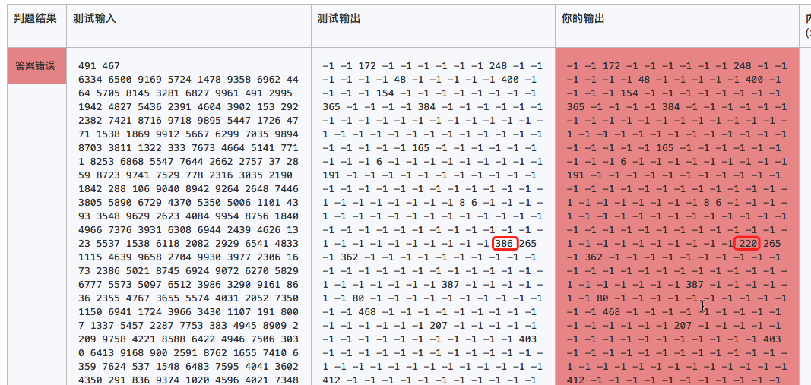

## 数组的操作

##### 1. 遍历

[题目 1026: [编程入门]数字逆序输出](https://www.dotcpp.com/oj/problem1026.html)

输入10个数字，然后逆序输出。

```c
#include<stdio.h>
int main()
{
    int a[10], i;
    for (i = 0; i < 10; i++)
        scanf("%d", a+i);
    for (i = 9; i >= 0; i--)
        printf("%d ", a[i]);
    return 0;
}
```


##### 2. 查找

- 顺序查找

    [题目 1710: 数据结构-静态表的顺序查找](https://www.dotcpp.com/oj/problem1710.html)

    ```c
    #include<stdio.h>
    int main()
    {
        int a[501], n, k, i, x;
        scanf("%d %d", &n, &k);
        for (i = 0; i < n; i++)
            scanf("%d", a+i);
        while(k--)
        {
            scanf("%d", &x);
            int find = -1;
            for (i = n-1; i >= 0; i--)
                if (a[i] == x){
                    find = i;break;
                }
            printf("%d ", find);
        }
        printf("\n");
        return 0;
    }
    ```

    花费29元找到了测试数据错误：

    ```c
    #incluce<stdio.h>
    int main()
    {
        int a[] = {6334,6500,9169,5724,1478,9358,6962,4464,5705,8145,3281,6827,9961,491,2995,1942,4827,5436,2391,4604,3902,153,292,2382,7421,8716,9718,9895,5447,1726,4771,1538,1869,9912,5667,6299,7035,9894,8703,3811,1322,333,7673,4664,5141,7711,8253,6868,5547,7644,2662,2757,37,2859,8723,9741,7529,778,2316,3035,2190,1842,288,106,9040,8942,9264,2648,7446,3805,5890,6729,4370,5350,5006,1101,4393,3548,9629,2623,4084,9954,8756,1840,4966,7376,3931,6308,6944,2439,4626,1323,5537,1538,6118,2082,2929,6541,4833,1115,4639,9658,2704,9930,3977,2306,1673,2386,5021,8745,6924,9072,6270,5829,6777,5573,5097,6512,3986,3290,9161,8636,2355,4767,3655,5574,4031,2052,7350,1150,6941,1724,3966,3430,1107,191,8007,1337,5457,2287,7753,383,4945,8909,2209,9758,4221,8588,6422,4946,7506,3030,6413,9168,900,2591,8762,1655,7410,6359,7624,537,1548,6483,7595,4041,3602,4350,291,836,9374,1020,4596,4021,7348,3199,9668,4484,8281,4734,53,1999,6418,7938,6900,3788,8127,467,3728,4893,4648,2483,7807,2421,4310,6617,2813,9514,4309,7616,8935,7451,600,5249,6519,1556,2798,303,6224,1008,5844,2609,4989,2702,3195,485,3093,4343,523,1587,9314,9503,7448,5200,3458,6618,580,9796,4798,5281,9589,798,8009,7157,472,3622,8538,2292,6038,4179,8190,9657,7958,6191,9815,2888,9156,1511,6202,2634,4272,55,328,2646,6362,4886,8875,8433,9869,142,3844,1416,1881,1998,322,8651,21,5699,3557,8476,7892,4389,5075,712,2600,2510,1003,6869,7861,4688,3401,9789,5255,6423,5002,585,4182,285,7088,1426,8617,3757,9832,932,4169,2154,5721,7189,9976,1329,2368,8692,1425,555,3434,6549,7441,9512,145,8060,1718,3753,6139,2423,6279,5996,6687,2529,2549,7437,9866,2949,193,3195,3297,416,8286,6105,4488,6282,2455,5734,8114,1701,1316,671,5786,2263,4313,4355,1185,53,912,808,1832,945,4313,7756,8321,9558,3646,7982,481,4144,3196,222,7129,2161,5535,450,1173,466,2044,1659,6292,6439,7253,24,6154,9510,4745,649,3186,8313,4474,8022,2168,4018,8787,9905,7958,7391,202,3625,6477,4414,9314,5824,9334,5874,4372,159,1833,8070,7487,8297,7518,8177,7773,2270,1763,2668,7192,3985,3102,8480,9213,7627,4802,4099,527,2625,1543,1924,1023,9972,3061,4181,1003,7432,7505,7593,2725,3031,8492,142,7222,1286,3064,7900,9187,8360,2413,974,4270,9170,235,833,9711,5760,8896,4667,7285,2550,140,3694,2695,1624,8019,2125,6576,1694,2658,6302,7371,2466,4678,2593,3851,5484,1018,8464,1119,3152,2800,8087,1060,1926,9010,4757,2170,315,9576,227,2043,2758,7164,5109,7882,7086,9565,3487,9577,4474,2625,5627,5629,1928,5423,8520,6902};
        printf("%d %d", a[220], a[386]); // 9314
    }
    ```

    

    

- 折半查找

    https://www.dotcpp.com/oj/problem1711.html


##### 3. 插入

[题目 1025: [编程入门]数组插入处理](https://www.dotcpp.com/oj/problem1025.html)

已有一个已正序排好的9个元素的数组，输入一个数要求按原来排序的规律将它插入数组中。

```c
#include<stdio.h>
int main()
{
    int a[10], x, i, j;
    for (i = 0; i < 9; i++) // 输入9个数
        scanf("%d", a+i);
    scanf("%d", &x); // 输入要插入的 x
    
    j = 8;//从后往前比较，大的数后移
    while (j>=0 &&a[j] > x){
        a[j+1] = a[j]; // 数据后移
        j--;
    }
    a[j+1] = x; //插入x
    
    for (i = 0; i < 10; i++) //输出数组10个元素
        printf("%d\n", a[i]);
    return 0;
}
```


##### 4. 删除

[题目 1479: 蓝桥杯算法提高VIP-删除数组中的0元素](https://www.dotcpp.com/oj/problem1479.html)

```c
#include<stdio.h>
int main()
{
    int a[100], i, j;
    int n; 
    
    scanf("%d", &n);// 输入数组元素个数
    for (i = 0; i < n; i++)
        scanf("%d", a+i);//输入n个元素到数组
    
    for (i = 0; i < n; ) // 遍历数组每个元素
    {
        if (0 == a[i])
        {
            for (j = i + 1; j < n; j++)
                a[j-1] = a[j];  //数据迁移删掉值为0的a[i]
            n--; //元素个数减1
        }
        else i++; //遍历下一个元素
    }
    // 输出数组中所有元素
    for (i = 0; i < n; i++)
        printf("%d ", a[i]);
    printf("\n%d", n); //输出数组元素个数
    return 0;
}
```


