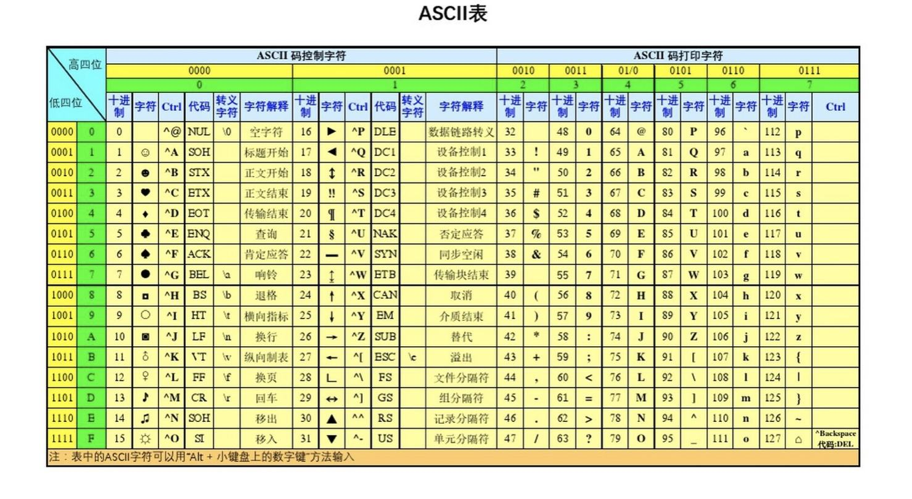

## 变量


#### 1.变量的定义

变量就像一个盒子用来存放数据。


`int` 表示整型，对应盒子只能存放整型数据。`float` 表示浮点型，对应盒子只能存放小数，`double` 表示双精度浮点型，能存储比`float`精度更高的小数。`char` 字符类型，用来存储单引号括起来的单个字符。

- **变量的定义**

变量必须先定义再使用。变量的定义：

> 数据类型  变量名;

```c
int a;  
```

`int` 表示整型，`a`是变量名，分号是一句话的结束，中间用空格隔开。在定义变量的同时可以给变量赋初始值，也可以一次定义多个变量，变量之间用逗号分隔开：

```c
float b = 3.14;	// 定义的同时赋初值
char x, y, z;	// 同时定义多个变量
```

- **变量名**

变量名只能由字母、数字、下划线组成，且第一个字符不能是数字。C语言关键字不能作为变量名。

```c
int 3b; 	// 错误：不能数字开头
int next day;	// 错误：不能有空格
int double; //错误：C语言关键字不能作为变量名
```

#### 2. 变量的赋值

我们通过赋值运算符 `=` 把右边的数据放入到左边变量盒子里。

```c
int a;
a = 1;
a = 2;
```


也可以把加减乘除运算的结果放到变量盒子里：


```c
int a = 7;
a = a + 1;      // + 加法
a = a - 1;      // 减法
a = a * 2;      // 乘法
a = 5 / 9;      // 除法，注意:5/9的值是0，因为C语言中整数/整数结果还是整数类型。
    
float b;
b = 5 / 9;        // b的值：0.000000
b = 5.0 / 9;      // b的值：0.555556  自动类型转换
b =(float) 5 / 9; // 强制类型转换
```

#### 3.变量的输出


用 `printf` 函数输出变量的值。`printf`第一个参数是用双引号括起来的一串字符，称为格式串，用来控制输出，双引号中有什么字符就会输出什么字符。

```c
printf("hello world.");	// 输出hello world
```

格式串中的 `%` 是控制符：`%d` 整数，`%f` 浮点数，`%c` 字符。

- 输出整型数据

```c
#include<stdio.h>
int main()
{
    int c = 7;
    printf("%d\n", c);  // %d  十进制整数
    pirntf("c=%d", c);
    printf("%d %o %x", c, c, c); // %o 八进制   %x 十六进制
    return 0;
}
```

- 输出浮点型数据

```c
 	float pi = 3.1415926;
    printf("%f\n", pi);  // %f  浮点数，默认保留6位小数
    printf("%.4f\n", pi); //%.4f 保留4位小数
    
    double pi2 = 3.14159265358979;//双精度浮点数
    printf("%.8f\n", pi2); //%.8f 保留8位小数
```

- 输出浮点型数据

```c
 	char ch = 'a';
    printf("%c\n", ch);  // %c 输出字符
    printf("%c\n", ch+1);
    printf("%c\n", ch - 32);//小写字母转大写字母输出
    printf("%d\n", ch);  // 字符对应ASCII码整数
    printf("%c\n", 'A'+32); //大写转小写字母输出
    putchar(ch);
```


ASCII 表：



#### 4.变量的输入


我们说变量就像一个盒子，用来放数据，怎么从键盘输入一个数据到变量中呢？

通过取地址运算 `&a` 可以得到变量在内存中的地址。有了内存地址我们就可以把数据从键盘送入到变量中了。

- 输入整型数据

```c
int a;
scanf("%d", &a);  // 从键盘输入一个整数到变量a中
printf("%d",a);
printf("a=%d", a);

int c, d;
scanf("%d %d", &c, &d);
printf("%d", c+d);

int y, m, d;
scanf("%d %d %d", &y, &m, &d); // 输入数据格式： 2021 12 18
printf("%d年%d月%d日", y, m, d);

scanf("%d-%d-%d", &y, &m, &d); // 输入数据格式：2021-12-18
scanf("%d/%d/%d", &y, &m, &d); // 输入数据格式：2021/12/18

```

- 输入浮点数据

```c
float f;
scanf("%f", &f);

double e;
scanf("%lf", &e);
```

- 输入字符数据

```c
char ch;
scanf("%c", &ch);  // 从键盘输入一个字符
ch = getchar();
```

#### Online Judge 题

- [题目1005](https://www.dotcpp.com/oj/problem1005.html)：温度转换，输入一个华氏温度，转摄氏温度输出。转换公式 C = 5/9（F-32) 。保留两位小数。

```c
#include<stdio.h>
int main()
{
    float C, F;
    scanf("%f", &F);
    C = 5.0 * (F -32) / 9;  // 不能写5/9 ，因为5/9值为0
    printf("c=%.2f", C);      // .2表示保留两位小数
    return 0;
}
```

- [题目1003](https://www.dotcpp.com/oj/problem1003.html)：密码破译，输入5个字母，用原字母后面的第4个字母代替原字母，输出替换后的5个字母。

```c
#include<stdio.h>
int main()
{
    char c1, c2, c3, c4, c5;
    scanf("%c%c%c%c%c", &c1, &c2, &c3, &c4, &c5);
    c1 = c1 + 4;
    c2 = c2 + 4;
    c3 = c3 + 4;
    c4 = c4 + 4;
    c5 = c5 + 4;
    printf("%c%c%c%c%c",c1,c2,c3,c4,c5);
    return 0;
}
```

#### 练习题

```tex
1. C程序中的变量必须“先定义，后使用”，完成以下变量的定义：
   定义a,b两个整型变量：_______________
   定义x为双精度浮点型变量：____________
   定义ch为字符型变量：________________
   定义y为浮点变量并赋初值2.368：　_____________
   
```

```tex
2.下列符号可以作为变量名的是（        ）
    A. +a            B. 3p            C. _DAY            D. next day
```

```tex
3.  修改下面程序中的错误
    #include<stdio.h>
    main()
    {
        x = 3;
        y = 5;
        z = x * y;
        printf("z=%d\n", z);
    }
```

```tex
4.下面程序输出结果是
#include<stdio.h>
int main()
{
    int k = 15;
    printf("%d,%o,%x", k, k, k);
    return 0;
}
```

```tex
5.下面程序输出结果是
#include<stdio.h>
int main()
{
    int k = 3/4+2;
    printf("%d", k);
    return 0;
}
```

```tex
6.下面程序输出结果是
#include<stdio.h>
int main()
{
    double k = 3.6 - 5.0 / 2;
    printf("%f", k);
    return 0;
}
```

```tex
7.下面程序输出结果是
#include<stdio.h>
int main()
{
    int a = 2, b = 3;
    float k = (float)(a+b)/2;
    printf("%f", k);
    return 0;
}
```

```tex
8. 有输入语句：
	scanf("a=%d,b=%d",&a,&b);
为使变量a的值为1，b的值为2，正确的数据输入方式是(     )
A.12↙ 	B.1,2↙ 	C.a=1,b=2↙ 	D.a=1 b=2↙
```

```tex
9. 若有语句：int x=12,y=8,z;
	z=0.8+x/y;
	执行语句后z的值为(     )
A.1.8    B.1    C.2    D.2.4
```

```tex
10. 若有语句：int a,b;
scanf("%d;%d"，&a,&b);
如果把整数4赋给a，把整数5赋给b，应该输入(     )
A.4  5    B.4,5    C．45    D. 4;5
```


#### 小结

- 基本数据类型： `int `，`float`，`double` ，`char` 
- 变量的定义：`数据类型  变量名;`
- 变量名命名：字母、数字、下划线组成，第一个不能是数字。不能用C语言关键字。
- 赋值运算符： `=` 。 `+ - * / ` 运算。 类型转换。
- 输出函数：`printf` ，格式控制符 `%d %o %x %f %.4f %c` ，和字符输出函数 `putchar(ch)` 。
- 输入函数：`scanf` 
- `Online Judge` 题库 `dotcpp.com` 的使用
- 练习题


#### 参考资料

- [《啊哈C语言》](https://book.douban.com/subject/26943280/)：插图摘自这本书，特别可爱好玩又直观。
- [课课通《C语言同步练习与测试卷》](https://e.jd.com/30467674.html)：课堂练习题摘自这本书。

- [dotcpp](https://www.dotcpp.com/)：Online Judge 题库。


------

**教学反思与改进**

- 输出函数增加宽度格式控制：`printf("%4d %9.2f", 10, 3.14);`
- 输入函数增加宽度格式控制：`scanf("%4d%*3d%2d", &a, &b);`
- 增加上机操作题：
  - 面积计算
  - 身体质量指数计算
  - 字符与整数混合运算
  - 交换两个变量的值
  - 输入一个数，输出该数的平方
  - 输入一个大写字母，输出对应小写字母
- 增加书面练习题

