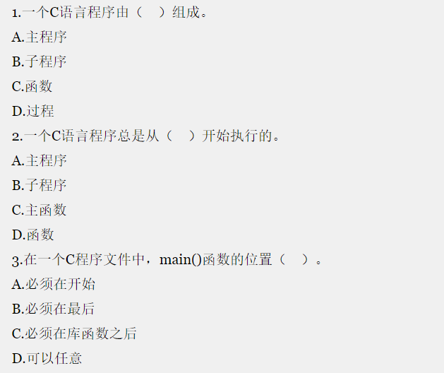

## hello,world

[TOC]


###### 编写程序输出 hello,world

```c
#include <stdio.h>

int main()
{
    printf("hello,world\n");
    return 0;
}

/* 
1. 预处理
#  预处理指令的开始
include  包含
<stdio.h> 标准输入输出

2. main函数
int main()
{
    return 0;
}
C程序由函数和变量组成，函数包含一些语句，完成指定操作。
程序总是从main函数开始执行，也就是每个程序都必须包含main函数。
函数中的语句用{}括起来。

3. 显示字符串
printf("hello,world\n");
输出函数，括号内双引号括起来的，是输出内容，\n表示换行，分号表示一句话的结束。
一般一行只写一条语句。

4. 注释
   单行注释  //
   多行注释  /**/

*/
```


###### 练习题



