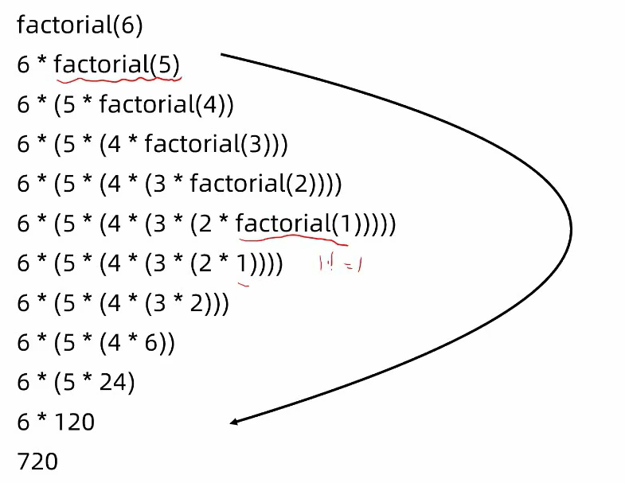

## 第2周  递归、分治

###### [146. LRU 缓存机制](https://leetcode-cn.com/problems/lru-cache/)


###### [811. 子域名访问计数](https://leetcode-cn.com/problems/subdomain-visit-count/)


###### [697. 数组的度](https://leetcode-cn.com/problems/degree-of-an-array/)


###### [1074. 元素和为目标值的子矩阵数量](https://leetcode-cn.com/problems/number-of-submatrices-that-sum-to-target/)


###### [23. 合并K个升序链表](https://leetcode-cn.com/problems/merge-k-sorted-lists/)


### 课堂笔记

###### 递归

```python
// 计算 n！ = 1*2*3*...*n
def factorial(n):
    if n <= 1:
        return 1
    return n * factorial(n-1)

```



为什么要用递归？

求n!，用递推不就可以了吗。确实，对与n!用递推更好。但是如果不容易找到地推路径，用递归会更方便。例如，遍历一颗树。

递归的三个关键：

- 定义子问题
- 递归边界
- 保护与还原现场

###### [78. 子集](https://leetcode-cn.com/problems/subsets/)

