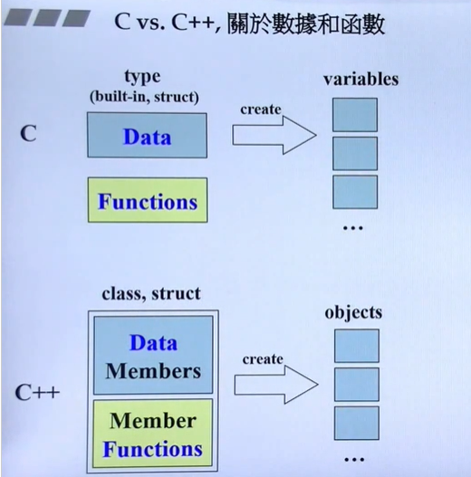
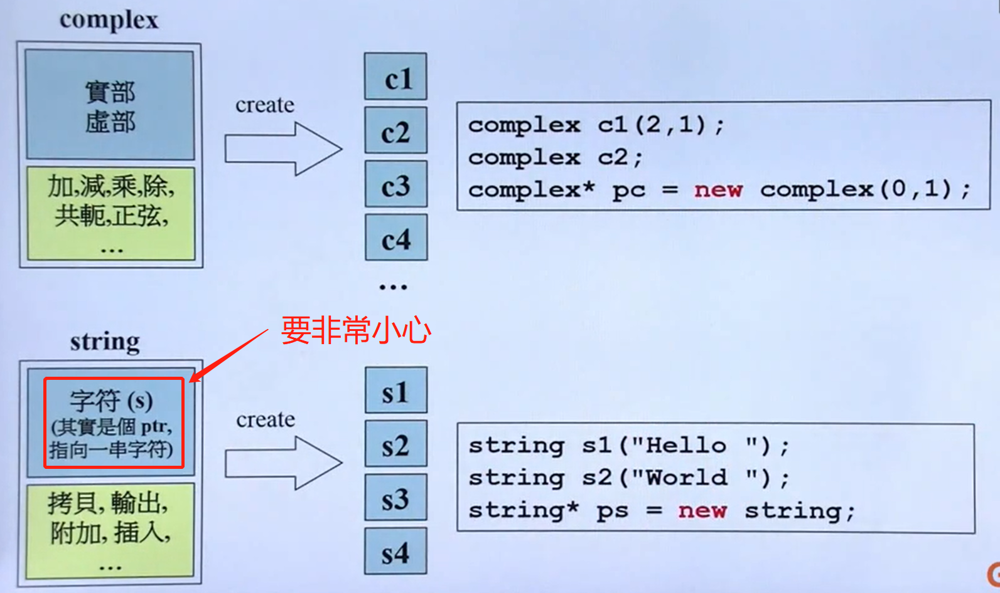

## 头文件与类声明

[TOC]

###### C vs C++



C++关于数据与函数



###### 头文件申明

头文件的引入

```c++
#include<iostream.h>  // 标准库头文件引入
#include "myhead.h"   // 自己头文件引入
```

防卫式申明

```c++
// complex.h
#ifndef __COMPLEX__		// guard  防卫式申明
#define __COMPLEX__

#endif
```

###### class的申明

```c++
#ifndef __COMPLEX__
#define __COMPLEX__

#include<cmath>

// 0  前置声明


// 1  类声明
template<typename T>  // class template 模板
class complex
{
    private:
    	T re, im;
    ......
}

// 2  类定义
complex:: function ...
    
#endif 
```

