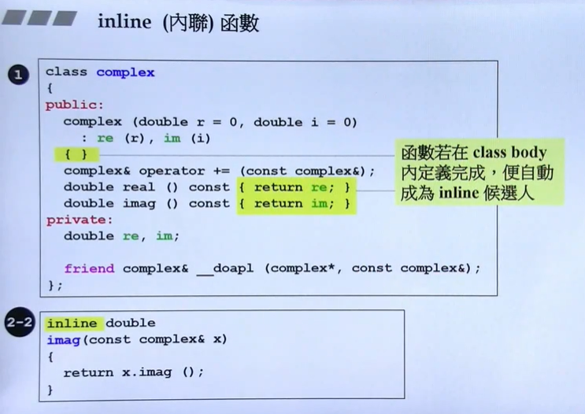

## 构造函数

[TOC]


###### inline函数



```c++
// 在类的内部定义的函数，或有inline修饰的函数
// 但是函数如果太复杂，编译器没办法把函数真正定义成inline

```

###### access level（访问级别）

```c++
class complex
{
    public:  // 一般写函数，提供给外部使用
    private: // 一般写成员数据，禁止外部直接访问，如果要获取数据，只能通过public提供的接口
    friend   // 友元
    
}
```

###### 构造函数

```c++
class complex
{
    public:
    	complex (double r = 0, double i = 0)  // 默认参数
            : re (r), im (i)	// 初始列表 等价于{re = r; im = i;}
        { }
    	
    private :
    	double re, im;
}

// 构造函数，必须和类名一样。
// 成员函数不能调用构造函数
// 构造函数可以重载（overloading）
```

###### 传值与传引用

函数参数，函数返回值，尽量传引用。