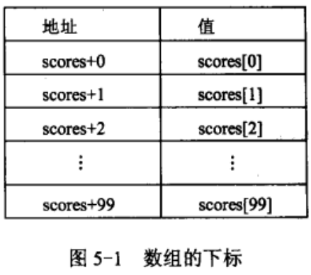

## 一维数组

[TOC]

### （一）是什么

​	数组：类型相同且按顺序存放的一组元素。

##### 1. 数组的定义

> 类型说明符    数组名[元素个数];

```c
int a[10];				// 数组名a，有10个int元素
double scores[50*2];	 // 数组名scores，有100个double
```

> 注意：
>
> 1. 数组名，命名规则和变量名命名规则相同：只能有字母、数字和下划线组成且第一个字母只能是字母或下划线。
>
> 2. 数组元素的个数，整型常量表达式给定，必须是整数，也必须是常量（不能是变量）。
>
> 3. 数组元素通过下标访问，下标从0开始，不能越界访问。例如，上面定义了scores数组，数据访问形式是： scores[0],scores[1]...scores[99]。数组在内存是连续存放的，数组名是首地址。
>
>    

##### 2. 数组的初始化

​	数组的初始化，就是在定义数组的同时，给数组各元素赋初始值。

```c
// 1. 为全部元素赋值
int a[10] = {1,2,3,4,5,6,7,8,9,10}; // a[0] 的值为1， a[1]的值为2，依次赋值，a[9]的值为10

// 2. 为部分元素赋值
int a[10] = {1,2,3,4}; // a[0]的值为1，a[1]的值为2，a[2]的值为3，a[3]的值为4，剩下元素值为0

// 3. 省略数组长度初始化
int a[] = {1,2,3};
// 编译器根据初始化列表值的个数自动定义数组长度为3。没有初始化列表时，数组长度不能省。
```

> 注意：只有在定义数组时才可以同时给数组所有元素赋，定义过后只能通过下标一个一个访问赋值。

```c
int a[10];
a[10] = {1,2,3,4,5,6,7,8,9,10};  // 错误！！！！！！！！！！！！！！
// 错误一：a[10]错误，数组下标从0开始，只能是a[0]~a[9]。a[10]越界错误。
// 错误二：a[i]={1,2,3}错误，不能在定义后通过{}形式赋值。a[i]=6可以，通过下标是访问一个元素，不能赋一组值。

```

### （二）不是什么

##### 3. 数组使用常见的错误

```text
1. 以下一维数组的定义方式，正确的是（    ）
	A. int n = 10;			B. #define MAX  10		C. int a[8.5];			D. int a[];
	   int a[n];			   int a[MAX]

2. 若有说明“int a[3];”，则对数组a中元素的正确引用是（    ）
	A. [3]		B. a(2)		C. a[1]		D. a[-2]
	
3. 下列能够正确的给a[0] ~ a[2]赋值为1，2，3的是（    ）
	A. int a[10] = 1、2、3;            B. int a[10] = {10*1*2*3};
	C. int a[10] = {1,2,3,...};        D. int a[] = {1,2,3};
	
4. 下面程序中，有错误的行是（      ）
	L1    #include<stdio.h>
	L2    int main()
	L3    {
	L4        int a[3], i; 
	L5        a[3] = {1,2,3};
	L6        for(i = 1; i < 3; i++)
	L7            a[0] = a[0] + a[i];
	L8        printf("%d",a[0]);
	L10    }

5. 若有说明“float a[] = {1,2,3,4};”，则下列叙述中正确的是（    ）
	A. 将4个初值依次赋给a[1]至a[4]
	B. 将4个初值依次赋给a[0]至a[3]
	C. 将4个初值依次赋给a[6]至a[9]
	D. 因为数组长度与初值个数不同，所以此语句错误。
	
6. 以下数组定义和初始化中，下标值为4的数组元素值为（       ）
	float x[10] = {1, 2.5, 3, 4.5, 5.2, 6.2, 9};
	A. 4.5 			B. 4			C. 5.2			D. 5

```

> B、C、D、L5、B、C

### （三）数组的应用

##### 4. 简单应用

​	例1：输出Fibonacci序列的前10个数。1，1，2，3，5，8......

```c
#include<stdio.h>
int main()
{
    int i, a[10] = {1,1};
    for(i = 2; i < 10; i++)
        a[i] = _________________;		
    for(i = 0; i < 10; i++)
        printf("%4d", a[i]);
    return 0;
}
```

> `a[i-1] + a[i-2]`

​	例2：统计数组中每个数字的个数

```c
#include<stdio.h>
int main()
{
    int s[12]={1,2,3,4,4,3,2,1,1,1,2,3}, i;
    int c[5] = {0};						// c[i]表示数字i出现的次数。
    for(i = 0; i < 12; i++)
        ________________ ;							
    for(i = 1; i<5; i++)
        printf("%d 出现的次数：%d",i, c[i]);
    return 0;
}
```

> `c[s[i]]++`	

​	例3：输入10个学生成绩，统计低于平均分的人数并输出。

```c
#include<stdio.h>
#define N  10
int main()
{
    int i, count = 0;
    _______________________;
    float sum, ave;
    
    for(i = 0; i < N; i)
        scanf("%f", ___________);  
    
    for(sum = 0, i = 0; i < N; i++)
        sum += scores[i];		 // 求总分
    ave = ___________;			// 求平均分
    
    for(i = 0; i < N; i++)
        if(__________________)
            count++;			// 统计低于平均分的人数
    pirntf("%d", count);
}
```

> `float scores[N] `
>
> `&scores[i]` 或 `scores+i`
>
> `sum / N`
>
> `scores[i] < ave`	

​	例4：输入一个整数，转二进制输出。

```c
#include<stdio.h>
#define N 32
int main()
{
    int n, i = 0, b[N];
    scanf("%d", &n);
    do
    {
        ____________;	
        n = n / 2;
    }while(n);
    for(; i > 0; i--)
        printf("%d",______);	
    return 0;
}
```

> `b[i++] = n%2`
>
> `b[i-1]`

##### 5. 基本操作

###### 5.1 遍历

>  数组，在内存中按顺序依次存放，通过下标可以随机访问每一个元素，下标从0开始。

​	例1：输入10个数逆序输出。

```c
#include<stdio.h>
int main()
{
    ____________________;
    int i;
    for(i = 0; i < 10; i++){
        scanf("%d", _______);
    }
    for(i = 9; i >= 0; _______){
        printf("%d ", a[i]);
    }
    return 0;
}
```

> `int a[10]`
>
> `&a[i]` 或 `a+i`
>
> `i--`

​	例2：输出数组中最大值和最小值。

```c
#include<stdio.h>
int getMax(int a[], int n)	// 返回数组最大值
{
    int i, max = a[0];
    for(i = 1; i < n; i++)
    {
        if(_____________)
            max = a[i];
    }
    return max;
}
int getMin(int a[], int n)	// 返回数组最小值
{
    int i, min = a[0];
    for(i = 1; i < n; i++)
    {
        if(a[i] < min)
            _______________;
    }
    return min;
}
int main()
{
    int a[10] = {2,5,3,1,6,8,9,10,0,7}, max, min;
    max = getMax(a, 10);
    min = getMin(a, 10);
    printf("最大值是：%d\n", max);
    printf("最小值是：%d\n", min);
    return 0;
}
```

> `a[i] > max`
>
> `min = a[i]`

###### 5.2 查找

> 这里说的查找，是指在数组a中查找x是否存在，若存在返回其下标值，否则返回-1。

​	例1：在数组a中，顺序查找x，若找到返回下标值，否则返回-1。

```c
int find(int a[], int n, int x)	// 在数组中查找x，找到则返回在数组中的下标，没找到返回-1
{
    int i;
    for(i = 0; i < n; i++)
        if(_______________)
            return i;
    return -1;
}
int main()
{
    int a[10] = {1,2,3,4,5,}, i, x;
    scanf("%d", &x);	// 输入要查询的x
}
```

> `a[i] == x`	

​	例2：在数组a中找出最大值的下标位置，最小值的下标位置。

```c
int findMax(int a[], int n)	// 返回数组最大值的下标
{
    int max_i = 0, i;
    for(i = 1; i < n; i++)
        if(_______________)
            max_i = i;
    return max_i;
}
int findMin(int a[], int n)	// 返回数组最小值的下标
{
    int min_i = 0, i;
    for(i = 1; i < n; i++)
        if(a[i] < a[min_i])
            _____________;
    return min_i;
}
int main()
{
    int s[] = {3,-8,7,2,-1,4};
    printf("最大值是：%d，最大值的下标位置是：%d", getMax(s,6), findMax(s,6));
    printf("最小值是：%d，最小值的下标位置是：%d", getMin(s,6), findMin(s,6));
}
```

###### 5.3 插入

​	1）在数组尾插入一个数

```c
#define N 10
int main()
{
    // 1. 定义数组  n表示数组元素个数
    int a[N] = {1,2,3};		
    int n = 3, i;	
    
    // 2. 在数组尾插入 10 
    a[n++] = 10;		

    // 3. 循环插入N个数到数组尾
    while(n < N)	
    {
        scanf("%d", &x);
        ________________;		// a[n++] = x;
    }
    
    // 输出数组中的数
    for(i = 0; i < n; i++)
        printf("%4d", a[i]);
}

```

​	2）数组有n个元素，在下标pos（pos<n）的位置插入x。

```c
void insert(int a[], int n, int x, int pos)
{
    int j;
    if(pos < 0 || pos > n)
        return 0;
    for(j = n - 1; __________; j--)  // 后移数据，空出下标pos的位置  j >= pos
    	______________________;		// a[j+1] = a[j]
	a[pos] = x; 				   // 在pos位置插入x
    return 1;
}
int main()
{
    int a[20] = {3,7,10,12,18,20}, n = 6, x = 15, pos = 4, i;
    if( insert(a, n , x, pos) ) ++n;
    for(i = 0; i < n; i++)
        printf("%4d", a[i]);
}
```

​	3）有一个已排好序的序列{3,7,10,12,18,20}，输入一个数15，插入到该序列中，使之依然保持有序。

```c
#include<stdio.h>
int main()
{
    int a[20] = {3,7,10,12,18,20}, x = 15, i, j, n;
    i = 6;					// 初始元素个数
    j = i - 1;				// 从后往前找插入点
    while(j >= 0 && ____________)  // a[j] > x
    {
        __________________;		// 后移元素
        j--;
    }    
    a[j+1] = x;				// 插入x
    n = i + 1;    			// 元素个数
    for(i = 0; i < n; i++)
        printf("%4d", a[i]);
    return 0;
}
```

###### 5.4 删除

​	1）删除数组尾的一个元素

```c
int main()
{
    int a[] = {1,2,3,4,5};
    int i, n = 5; 	 // 数组元素个数
	--n; 			// 个数减1，相当于删除了数组最后一个元素 
    for(i = 0; i < n; i++)
        printf("%4d", a[i]);
}
```

​	2）删除数组中的元素x，后面的元素前移。

```c
int delet(int a[], int n, int x)
{
    int i = 0, j;
    while(a[i]!=x && i < n)		// 找到x元素的下标 i
        i++;
    
    if(i >= n) return 0;		// 没有找到x, 删除失败
    
    for( j = i + 1; j < n; j++)
        a[j-1] = a[j];		// 每个元素前移1个位置，覆盖删除x
    return 1;				// 删除x成功
}
int main()
{
    int a[] = {3,5,7,2,4,6,1,8,0,9},n = 10, x = 6, i;
    if( delet(a,n,x) ) --n;
    for(i = 0; i < n; i++)
        printf("%4d", a[i]);
    return 0;
}
```

### （四）历年高考题

###### 2020年高考

1. 7个待测样本中有且仅有一个样本指标超标，为了找到这唯一超标样本，采用3个检测试剂盒进行检测。方法如下∶把7个样本按1，2，3，…，7进行编号，并将其编号转换为相应的3位二进制数;把可重复使用的3个检测试剂盒进行编号，分别对应 3 位二进制数的每一位;如果样本编号3位二进制中的某位为1，就用相应二进制位（编号）的试剂盒进行检测;按上述方法对每一个待测样本进行检测;最后，检测为阳性（设定值为1）试剂盒编号组成的二进制数就是超标样本的编号。下面程序功能就是完成上述检测方法并输出超标样本编号，即∶"flag=7"。请补充完整。

   ```c
   int main()
   {  
       int sample[8] = {0,0,0,0,0,0,0,1}; /*样本编号，第7个数值为1表明其超标*/
   	int test[3] = {0};/*检测试剂盒编号，test[0]对应二进制最低位，test[2]对应最高位*/
   	int i, j, k ,base = 1, flag = 0;
   	for(i = 1; i <= 7; i++)
   	{
   		___________________
   		j = 0;
   		while(____________){
   			if(k%2==1)
   				test[j] = test[j] || sample[i];
   			_______________;
   			j++;
   		}	
   	}
   	for(i = 0; i < 3; i++){
   		flag += test[i]*base;
   		____________________;
   	}
   	printf("flag=%d", flag);
   	return 0;
   } 
   ```

   2. 下面程序输出结果是（            ）

   ```c
   int main()
   {
   	int a[] = {118, 65, 128}, i;
   	for(i = 0; i < 3; i++)
   		printf("%c", (a[i])&(a[i]-1) ? 'N' : 'Y');
   	return 0;
   }
   ```

   3. 下面程序输出结果是（            ）

   ```c
   #include<stdio.h>
   int main()
   {
       int a[] = {89,88,76,70,68,58};
       int x = 70, min, pos = -1, find = 0, low = 0, high = 5;
       while(!find && low <= high)
       {
           min = (high + low) / 2;
           if(x > a[mid])
               low = mid + 1;
           else if(x < a[mid])
               high = mid - 1;
           else{
               pos = mid;
               find = 1;
           }
       }
       printf("pos=%d",pos);
       return 0;
   }
   ```

###### 2019年高考

4. 下面程序功能是统计5个同学成绩（1~100间的整数）中低于平均成绩的人数并输出，请补全以下代码。

```c
#include<stdio.h>
int main()
{  
    int i,count=0;
    __________________________;
   	float ave=0.0;
   	printf("input 5 scores:\n");
   	for(i=0;i<5;i++)
   	{
     	_____________________;
     	ave+=score[i];
	}
  	__________________________;   
    for(i=0;i<5;i++)
  		if(_____________)
    		count++;
	printf("%2d",count);
}
```

###### 2018年高考

5. 入夏标志着春夏季节完成转换，气候学上入夏的标准是必须要连续5天日平均气温达到22℃或以上，则这连续5天中的第一天为入夏日。函数fun的功能是判断5月份是否入夏并输出有关信息，若入夏就返回是哪天，否则返回-1。请补全下列代码。

```c
#include<stdio.h>
int fun(int a[], int n)	/*a存放某月的每日气温值，n存放的是此月的天数*/
{
    int i, c = 0;
    for(i = 0; i < n; i++)
    {
        if(____________)
        {
            c++;
            if(c >= 5)____________;
            else ____________;
        }
        ______________;
    }
    return -1;
}
int main()
{
    int t[31]={20,21,22,22,19,18,18,19,22,23,
               22,21,20,21,24,22,25,24,23,
               21,23,22,21,22,25,26,30,28,27,28};
    int d;
    d=fun(t,31);
    if(d==-1)
        printf("Not in summer\n");
    else
        printf("5-%d in summer\n",d+1);
    return 0；
}
```

6. 下面程序输出结果是（                  ）

```c
#include<stdio.h>
int main()
{
    int a[20], i , m = 10, k = 8;
    for(i = 0; m > 0; i++){
        a[i] = m % k;
    }
    for(i--; i >= 0; i--)
        printf("%d", a[i]);
    return 0;
}
```

