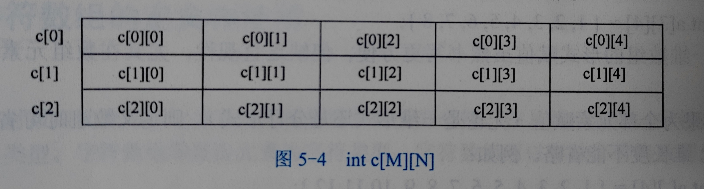

## 二维数组

###### 二维数组的定义及引用

```c
#define M 3
#define N 5
int c[M][N];
```



###### 二维数组的初始化

```c
// 1) 全部赋值
int a[3][4] = { {1,2,3,4},{5,6,7,8},{9,10,11,12} };

// 2) 部分赋值
int a[3][4] = { {1,2},{5},{9,10,11} };

// 3) 按一维数组形式赋值。（行优先存储）
int a[3][4] = {1,2,3,4,5,6,7,8,9,10,11,12};

// 4) 省略第1维度长度赋值
int a[][4] = { {1,2}, {}, {9,10,11} };
int b[][4] = {1,2,3,4,5,6,7,8,9};
```

###### 二维数组的遍历

```c
// P80 例5-3
int main()
{
    int a[3][4], i, j, count = 0;
    for(i = 0; i < 3; i++)
        for(j = 0; j < 4; j++){
            scanf("%d", &a[i][j]);
            if(a[i][j] < 0)
                count++;
        }
    printf("负数的个数：%d", count);
    return 0;
}
```