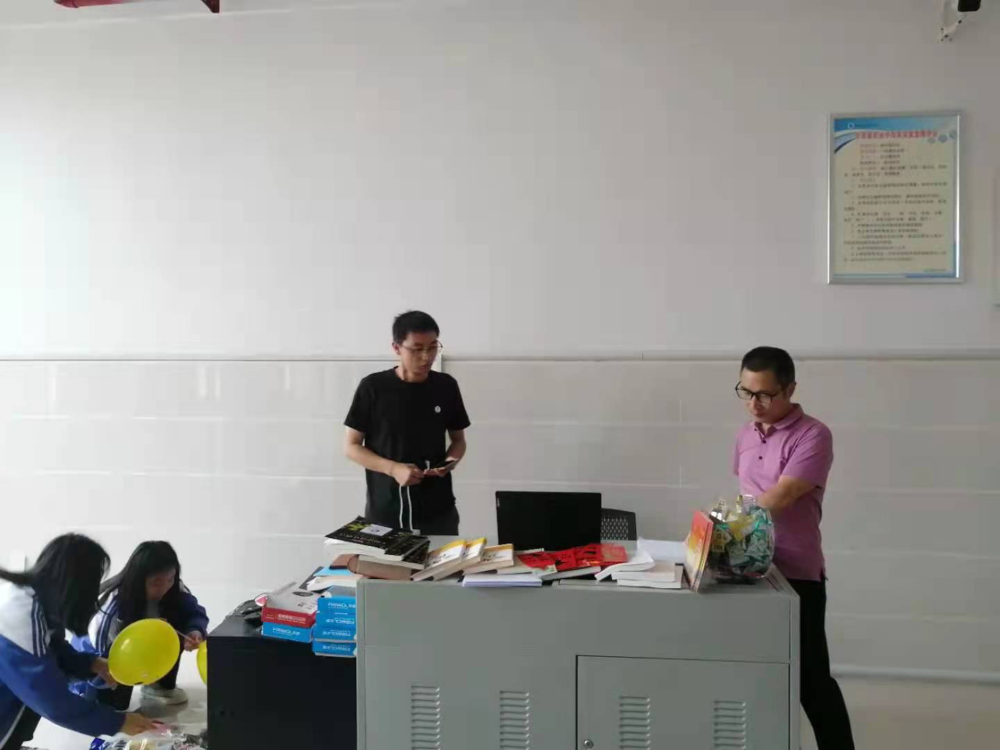
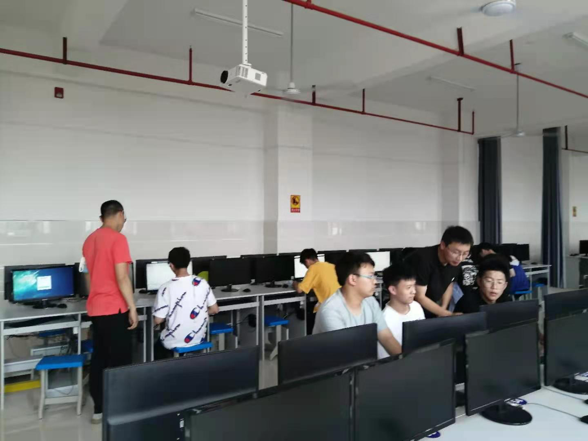
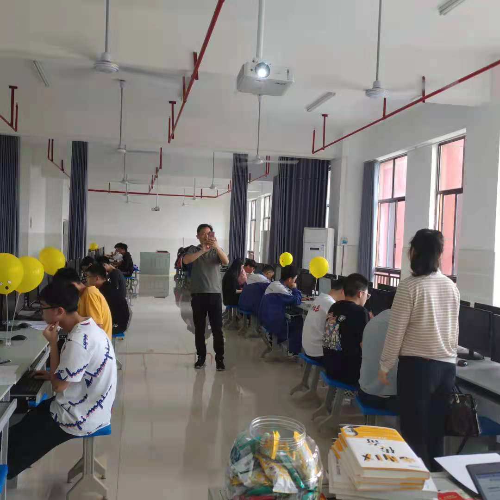
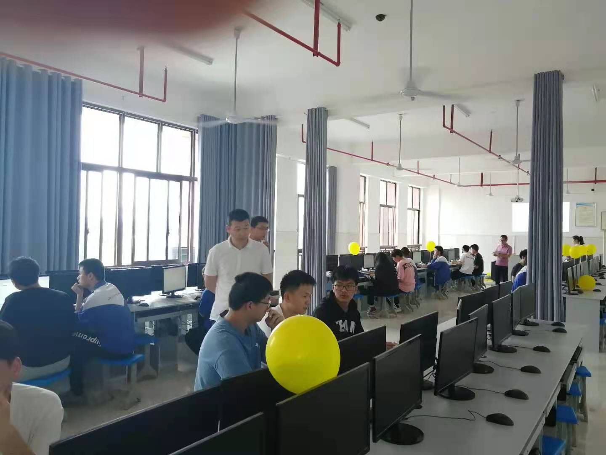
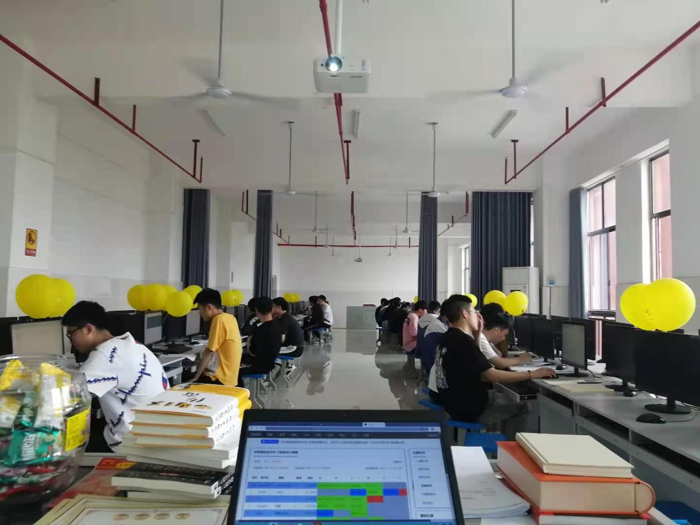
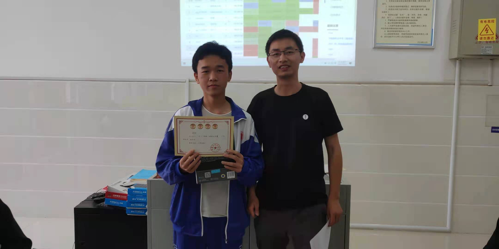
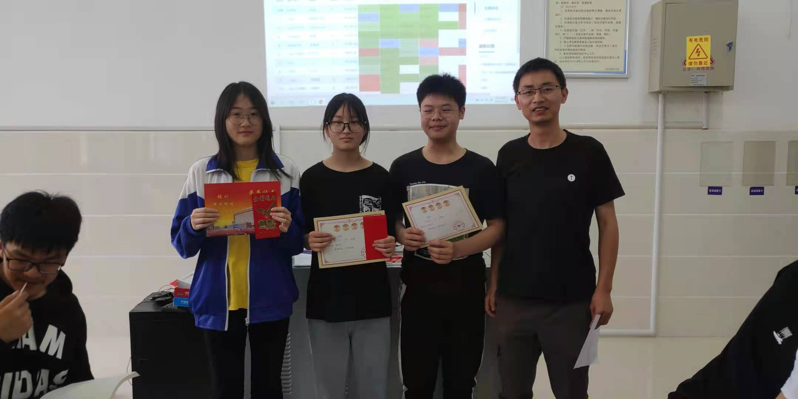
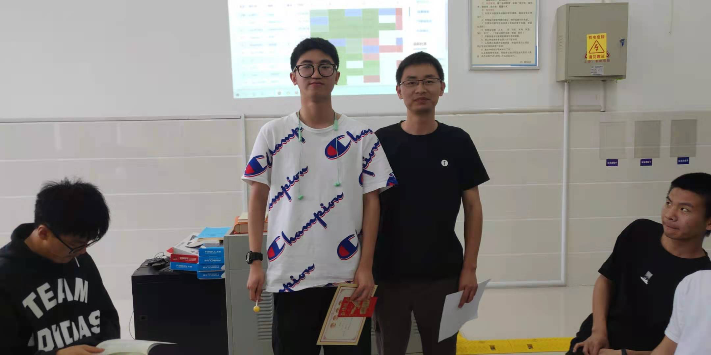
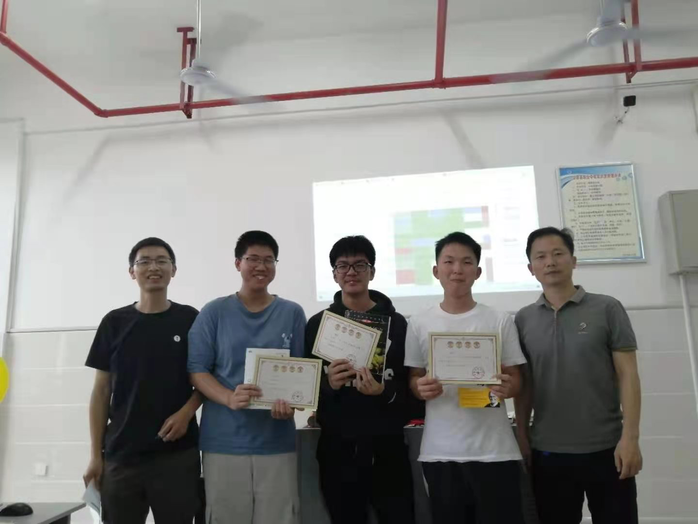

## C程序设计竞赛小结

5月12日下午，华容县职业中专计算机组开展了C程序设计竞赛活动，竞赛现场紧张激烈又有趣好玩。下面从竞赛过程，竞赛颁奖，反思改进三个方面进行回顾。

###### 1. 竞赛过程

 赛前准备：试题准备、奖品准备、气球等物品准备

 开始比赛啦，选手们初露峥嵘，每解出一题，小组立一个气球，营造紧张又充满趣味的竞技氛围。

 领导、同仁来竞赛现场观摩指导

 选手们披荆斩棘，锐意进取，顽强拼搏，力争上游

 经过两个小时的角逐，平台自动判题打分排名，比赛结束，成绩立刻揭晓。

###### 2. 竞赛颁奖

 三等奖：高二0327队，吴雨柔、潘智、鄢沙沙

 三等奖：高二无名小队，张霖，小哥哥一挑三。

 三等奖：不太熟组合，吴雨、魏金霞、李春友

 三等奖：fight alone, 胡越

 二等奖：等饭来，彭佳豪、毛合权、廖李显

 二等奖：战队，孙杰、李双喜

 一等奖：新手小唐，唐昌润

###### 3. 反思改进

1）试题采用的中学生信息竞赛平台，dotcpp平台。平台优点是题库丰富，在线自动判题打分排名。平台不适合的地方是，竞赛题要求写出完整代码，而中职对口高考并不考察完整代码的编写，侧重考察代码的阅读理解与逻辑分析。所以，竞赛题需要改编成对口高考常考题型：程序填空题。

2）题型改编后，先发纸质试题，同学们急于写代码，忽略了本可以更高效解题的信息，就是试题电子稿。因为，dotcpp平台判题要提交完整代码，题目经过改编后，很多同学照着试卷打代码，敲写这些代码很费时间，其实，我网上已提供，由于先发下纸质试卷题后，大家注意力转移，没有听到我后面关于试题的电子稿链接说明。改进，下次先发布试题电子稿链接，后发纸质试题。

3）可以结合教材成体系的把竞赛题改编成对口高考题型，竞赛平台题源更加科学丰富，练习、组考更高效。

###### 4. 鸣谢

活动能顺利举行，感谢孙耀武组长的信任与支持，感谢何朝辉老师的指导帮助与时间付出，感谢领导、同仁的支持与鼓励。

## 附录1：竞赛试题与参考代码

http://ixuexi.work/c-tutorial/jingsaishiti

## 附录2：C程序设计竞赛方案

为激发学生学习兴趣，锻炼学生实践能力，计算机组教研讨论决定，组织开展C程序设计竞赛活动。具体如下：

###### 竞赛时间

2021年5月12日（星期三）14：30~17：00  

###### 竞赛形式

不超过3人一组，每小组一台电脑，小组成员分工协作完成任务。地点：305机房上。题型：程序填空题，程序设计题。难度系数，和对口高考题难度相当。都需要提交完整代码，使用dotcpp平台，在线自动判题打分。

###### 竞赛报名

在校学生均可报名，需要C语言编程基础。即日起开始报名，5月12日12：00截止。

[报名地址：https://shimo.im/forms/jryjHkVrRQhhktqh/fill](https://shimo.im/forms/jryjHkVrRQhhktqh/fill)

###### 竞赛评委

孙耀武 何朝辉 潘勇 

###### 奖项设置

一等奖1个，二等奖2个，三等奖3个。

奖品：《UNIX传奇：历史与回忆》、Linus自传《只是为了好玩》、《C程序设计语言》。

