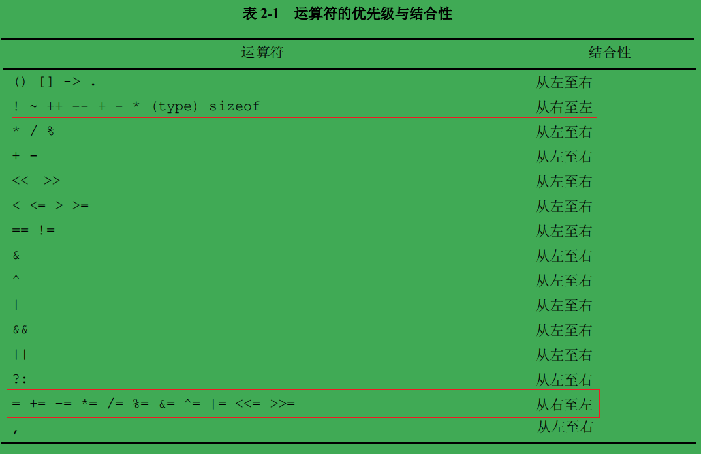
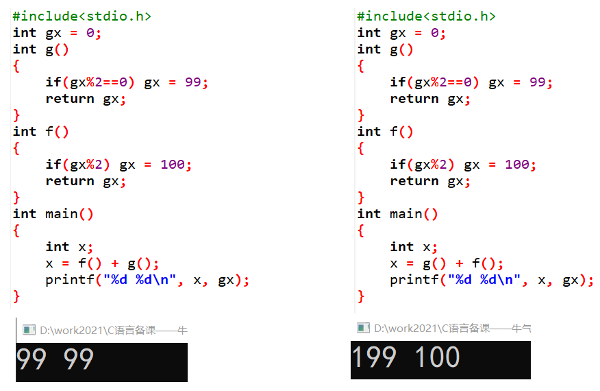
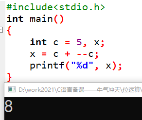
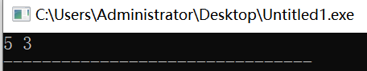
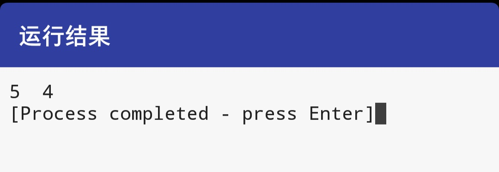
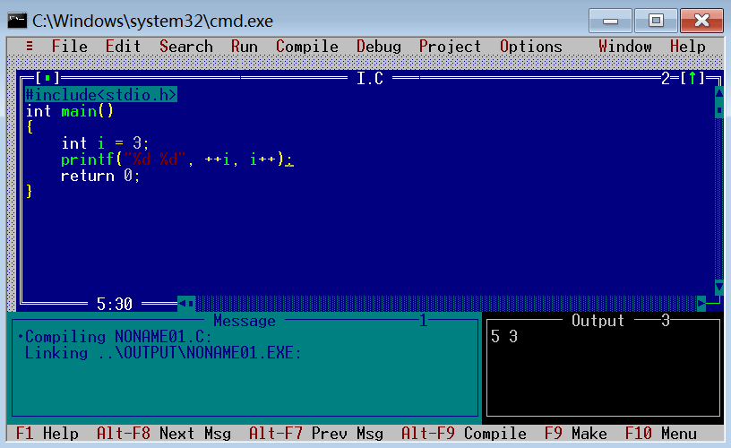

## 缺陷与陷阱

#### 一、表达式的执行顺序

一个表达式的执行顺序，由三个运算符规则，和编译器环境决定的。

1）运算符优先级。但优先级只对相邻操作符的执行顺序起作用。

2）运算符结合性。优先级相同，则由它们的结合性决定它们的执行顺序。



3）运算符指定操作数执行顺序。`&&  ||  ?:  ,` 指定了多个操作数的执行顺序。其它运算符并没有指定操作数的计算顺序。

```c
int w = 1, x = 2, y = 3, z = 4;
printf("%d", w>x?w:z>y?z:x);

z = a + b + c
执行顺序可以是： a+b 再 +c
也可以是：b + c 再 +a
但是这个顺序，并不影响结果
```

4）编译器环境。在遵循优先级和结合性规则情况下，没有指定操作数的计算顺序的运算符，执行顺序由编译器决定。C语言也没有指定函数各参数的求值顺序。函数调用、嵌套赋值语句、自增自减运算符，对表达式求值时，可能产生“副作用”——同时修改了变量的值。这些，和编译器环境相关的，执行顺序不同，运行结果也会不同的程序代码，都不是好的程序设计。以下代码，我们应该避免：

```c
x = f() + g()  
C语言里的+号，并没有规定两个操作数的执行顺序，可以先算f(),也可以先算g().
如果函数改变了某个全局变量的值，不同的执行顺序，结果会不同。
Windows DevC++上，是先执行f()，后执行g()。我们要避免写这类表达式，应该改写为：
x = f();   
x += g();
```



```c
x = c + --c
运算符+，先拿c的值，还是先处理++c——副作用会改变原来c的值，会导致运行结果不一样。
Windows DevC++上，是先执行--c，运算+时的c值是自减之后的值。
我们应该避免写这样的代码，改写为:
t = --c;
x = c + t;
```



1. 下面代码输出结果是（                 ）

```c
int main()
{
    int i = 3;
    printf("%d %d", ++i, i++);
}
```

- Window 10 Dev C++：函数参数是从后往前处理，先处理i++，后处理++i，输出的时候从前往后输出 5 3。



- Android手机运行结果：



- Windows 7 32位  



2. 下面程序的运行结果是（        ）

```c
#include<stdio.h>
struct tt{
    int n1; 
    char n2; 
    float n3;
    union uu { 
        int u1[2]; char u2[2]; 
    } su;
};
int main()
{
    printf("%d", sizeof(struct tt));		// Windows Dev-C++ 输出结果： 20
}
```

