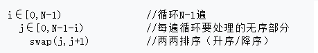

## 排序（一）

> 交换排序：冒泡排序、鸡尾酒排序、顺序交换排序、快速排序。



```c
// 冒泡排序：从前往后冒泡
void bubbleSort (int arr[], int len)// 写出序列：5 1 2 3 4 和序列：2 3 4 5 1的排序过程
{   
    int i, j,temp;
	for (i=0; i<len-1; i++)
    {    
        for (j=0; j<len-1-i; j++) 
		{   
            if (arr[j] > arr[j+1]){
				temp = arr[j];arr[j] = arr[j+1];arr[j+1] = temp;
			}
         }
    }
}
// 冒泡排序优化：没有交换结束冒泡
void bubbleSort1 (int arr[], int len)// 写出序列：5 1 2 3 4 和序列：2 3 4 5 1的排序过程
{   
    int i, j,temp, exchanged = 1;
	for (i=0; exchanged && i<len-1; i++)
    {    
         exchanged = 0;
		for (j=0; j<len-1-i; j++) 
		{   
             if (arr[j] > arr[j+1]){
				temp = arr[j];arr[j] = arr[j+1];arr[j+1] = temp;
				exchanged = 1; 
			}
        }
    }
}

// 冒泡排序：从后往前冒泡
void bubblesort2(int arr[], int len)// 写出序列：5 1 2 3 4 和序列：2 3 4 5 1的排序过程
{   
    int i, j,temp;
	for (i=0; i<len-1; i++)
    {    for (j=len-1; j>i; j--) 
		{   if (arr[j] < arr[j-1]){
				temp = arr[j];arr[j] = arr[j-1];arr[j-1] = temp;
			}
         }
    }
}

// 鸡尾酒排序：冒泡排序改进，来回冒泡。
void cocktail_sort(int arr[], int len) 	// 写出序列：5 1 2 3 4 和序列：2 3 4 5 1的排序过程
{   int i, temp, left = 0, right = len - 1;
	while (left < right) 
    {
		for (i = left; i < right; i++)
			if (arr[i] > arr[i + 1]) {
				temp = arr[i]; arr[i] = arr[i + 1]; arr[i + 1] = temp;
			}
		right--;
		for (i = right; i > left; i--)
			if (arr[i - 1] > arr[i]) {
				temp = arr[i]; arr[i] = arr[i - 1]; arr[i - 1] = temp;
			}
		left++;
	}
}
// 顺序交换排序（冒泡排序、选择排序结合）
void sort(int arr[], int len) // 写出序列：5 1 2 3 4 和序列：2 3 4 5 1的排序过程
{   int i, j, temp;
    for(i = 0; i < len - 1; i++)
        for(j = i + 1; j < len; j++)
            if(a[i] > a[j]){
                temp = arr[i]; arr[i] = arr[j]; arr[j] = temp;
            }
}
// 快速排序1
void qsort(int v[], int left, int right)
{   int i, last;
    if(left >= right) return ; // 数组元素少于两个，不执行任何操作
    swap(v, left, (left+right)/2); // 将中间元素，作为划分子集的元素，放在v[0]的位置
    last = left;
    for(i = left + 1; i <= right; i++) // 用v[0]划分子集，小于v[0]的放在v[++last]中
        if(v[i] < v[left])
            swap(v, ++last, i);
    swap(v, left, last);// 将划分子集的元素v[0]恢复到中间
    qsort(v, left, last - 1);
    qsort(v, last+1, right);
}
void swap(int v[], int i, int j){
	int t;
    t = v[i] ; v[i] = v[j]; v[j] = t;
}
// 快速排序2
void qsort2(int arr[], int left, int right)
{   int i = left, j = right, v = arr[left];
    while(i < j)
    {
        while(i < j && arr[j] >= v) j--;	
        if(i < j) arr[i++] = arr[j];		// 右边找到一个比v小的，放到左边
        while(i < j && arr[i] <= v) i++;
        if(i < j) arr[j--] = arr[i];		// 左边找到一个比v大的，放到右边
    }
    arr[i] = v; 						  // v放中间
    if(left < i - 1)
    	qsort2(arr,left, i - 1);
    if(i+1 < right)
    	qsort2(arr,i+1, right);
}
```

1. 下面程序实现功能是：用冒泡排序法求出由11个整数组成的中间值，并输出所有大于中间值的偶数。程序有3处错误。

```c
L1   int main()
L2   {
L3       int i, j, temp, array[11];
L4       for(i = 0; i < 11; i++)
L5           scanf("%d", array[i]);
L6       for(i = 0; i < 11; i++)
L7           for(j = 0; j < 10; j++)
L8               if(array[j] > array[j+1]){
L9                   temp=array[j]; array[j]=array[j+1]; array[j+1]=temp;
L10              }
L11      printf("中间值：%d\n", array[5]);
L12      for(i = 0; i < 5; i++)
L13          if(array[i] / 2 == 0)
L14              printf("%d ", array[i]);
L15      return 0;
L16  }
```

2. 下列程序功能是对5个字符串按从小到大排序输出。以下程序只允许修改三行。

```c
L1   int main()
L2   {
L3       char a[5][10], t[10];
L4       int i, j;
L5       for(i = 0; i < 5; i++)
L6           scanf("%s", &a[i]);
L7       for(i = 0; i < 4; i++)
L8           for(j = 0; j < 4 - i; j++)
L9               if(a[j] > a[j+1]){
L10                  t = a[j], a[j] = a[j+1], a[j+1] = t;
L11              }
L12      for(i = 0; i < 5; i++)
L13          printf("%s\n", a[i]);
L14  }
```

3. 下面函数实现的是对结构体数组，按总分进行升序排序，请填空。

```c
struct student{
    char num[6]; char name[10]; int chinese, math, english, total;
};
void sort(struct student stu[], int N)
{
    int i, j;
    for(i = 0; i < _______; i++)
        for(j = ______; j < N - i - 1; j++)
            if(stu[j].total > stu[j+1].total){
                temp = stu[j];stu[j]=stu[j+1];stu[j+1]=temp;
            }
}
```

4. 以下程序的功能是：读入一个字符串（长度<80），将该字符串中的所有字符按ASCII码降序排序后输出。以下程序中有两处错误，请将错误处的行号及正确语句填入答题卡相应位置中。

```c
L1	#include<stdio.h>
L2	#include<string.h>
L3	void fun(char  t[])
L4	{	char  c;
L5		int i,j;
L6		for(i=0;i<strlen(t)-1;i++)
L7			for(j=i+1;j<strlen(t)-1;j++)
L8				if(t[i]<t[j])
L9				{
L10					c=[j];
L11					t[j]=t[i++];
L12					t[i]=c;
L13				}}
L14	main()
L15	{	char  s[81];
L16		printf("\nPlease  enter a character string :");
L17		gets(s);
L18		printf("\n\nBefore sorting :\n  %s",s);
L19		fun(s);
L20		printf("\nAfter sorting decendingly:\n %s",s);}
```

5. 下列程序采用快速排序算法对任意输入的10个整数排序。快速排序算法是一种经典的排序方法，它是冒泡排序算法的改进。该算法的主要思想是在待排序的n个数据中取第一数据作为基准值，将所有的数据分为两组，使得第一组中各数据值均小于或等于基准值，第二组中各数据值均大于基准值，这便完成了第一趟排序，再分别对第一组和第二组重复上述方法，直到每组只有一个数据为止。将正确的内容填入答题卡的相应位置，使程序完整(每空5分，共20分)

```c
	void qusort(int s[],int start,int end)
	{   int i,j;
		i=start;			/*将每组首个元素赋给i*/
		j=end;				/*将每组末尾元素赋给j*/
		s[0]=s[start];		/*设置基准值*/
		while(i<j)
		{
			while(____________①______________)
				j--;				/*位置左移*/
			if(i<j)
				s[i++]=s[j];	/*将s[j]放到s[i]的位置上，且i自增*/
			while(i<j&&s[i]<=s[0])
				i++;			/*位置右移*/
			if(i<j)
				__________②_________
		}
		s[i]=s[0];				/*将基准值放入指定位置*/
		if(start<i)
			qusort(s,start,j-1);	/*对分割出的部分递归调用函数qusort()*/
		if(i<end)
			__________③_________
	}
	main()
	{
		int a[11],i;
		printf("please input 10 numbers:\n");
		for(i=1;i<=10;i++)
			scanf("%d",&a[i]);
		_____________④______________
		printf("the sorted numbers:\n");
		for(i=1;i<=10;i++)
			printf("%4d",a[i]);
	}
```

6. 下面程序功能是：从键盘输入一个整数n（数组下标范围内的），把没有重复元素值的数组aa中比aa[n]小的元素放在aa[n]的左边，比aa[n]大的元素放在aa[n]的右边，数组元素仍然保存在原数组中。例如，如果aa[n]={33,67,42,58,25,76,85,16,41,56}，输入3，则输出结果是“33,42,25,16,41,56,58,67,76,85”，以下程序只允许修改三行。

```c
L1	#include <stdio.h>
L2	#include <N 10>
L3	void fun(int aa[ ],int n)
L4	{
L5	   int I,j=0,k=0,t;
L6	   int bb[N];
L7	   t=aa[j];
L8	   for(I=0;I<N;I++)
L9	   {
L10	     if(aa[I]>t)
L11	       bb[j++]=aa[I];
L12	     if(aa[I]<t)
L13	       aa[k++]=aa[I];
L14	    }
L15	   aa[k]=t;
L16	   for(I=0;I<j;I++,k++)
L17	     aa[k]=bb[I];
L18	}
L19	main()
L20	{
L21	  int i,n;
L22	  int aa[N]={33,67,42,58,25,76,85,16,41,56};
L23	  fun(aa,3);
L24	  printf("\n***new list***\n");
L25	  for(i=0;i<N;i++)
L26	    printf("%4d",aa[i]);
L27	}
```

7. 随机生成m个数组成一个无序正整数序列, 输入另一个数n, 然后以类似快速排序的方法找到序列中第n大的数。例如序列 {1,2,3,4,5,6}中第3大的数是4。请填空。

```c
#include <stdio.h>
int a[1000001],n,ans = -1;
void swap(int *pa,int *pb)
{
    int c;
    c = *pa; *pa = *pb; *pb = c;
}
int FindKth(int left, int right, int n)
{
    int tmp, value, i, j;
    if (left == right) return left;
    tmp = rand()% (right - left) + left;
    swap(a[tmp], a[left]);
    value = ________①___________   
    i = left;
    j = right;
    while (i < j)
    {
        while (i < j && ____②_____) j --;	
        if (i < j) { a[i] = a[j]; i++; } else break;
        while (i < j && _____③_____) i++;   
        if (i < j) { a[j] = a[i]; j--; } else break;
    }
    _________④_________  
    if (i < n) return  FindKth( _____⑤_____ ); 
    if (i > n) return  FindKth(left, i - 1, n);
    return i;
}
int main()
{
    int i;
    int m = 1000000;
    for (i = 1; i <= m; i++)
        a[i] = rand();
    scanf("%d", &n);
    ans = FindKth(1, m, n);
    printf("%d",a[ans]);
    return 0;
}
```

## 排序（二）

> 选择排序

1. 下面函数功能分别是查找数组最小值、最大值所在下标。请填空。

```c
int findMax(int a[], int n)
{
    int i, max_i = 0;
    for(i = 1; i < n; i++)
        if(a[max_i] < a[i])
            ___________;
    return max_i;
}
int findMin(int a[], int n)
{
    int i, min_i = 0;
    for(i = 1; i < n; i++)
        if(___________)
            min_i = i;
    return min_i;
}
```

2. 下列程序中函数f的功能是用选择排序法对一个数组中数据按升序进行排序。请填空。

```c
  void f(int a[], int N) /*a为待排序数组N为数据元素个数*/
  {    int i ,j,p,t;
       for(i=0;i<N-1;i++)
       {
           p=i;
           for(___________; j < N; j++)
               if(a[p] > a[j])
                   _________________;
           if(p!=i)
           {
               t=a[i];a[i]=a[p];a[p]=t;
     	   }
       }
}
```

3. 下面程序功能是：调用Sort()排序函数，通过传递相应参数用选择法按升序（或降序）对数组中的数进行排序。假设数组中存储数据为`{88,67,78,56,90}` ，若升序排序则结果为`{56, 67, 78, 88, 90}` ，若降序排序则结果为`{90, 88, 78, 67, 56}` 

```c
#include<stdio.h>
_______________  5 
__________________; // 排序函数声明
int Ascending(int a, int b);  // 升序
int Descending(int a, int b); // 降序
int main()
{   int i, score[N] = {88,67,78,56,90};
    _____________________; 		// 升序排序
    printf("The Ascending Sort is:");
    for(i = 0; i < 5; i++)
        printf("%d ", score[i]);
    Sort(score, 5, Descending);  // 降序排序
    printf("The Descending Sort is:");
    for(i = 0; i < 5; i++)
        printf("%d ", score[i]);
}
void Sort(int score[], int n, int (*compare)(int a, int b))
{   int i, j, k, t1, t2;
    for(i = 0; i < n-1; i++)
    {   k = i;
        for(j = i + 1; j < n; j++){
            if(______________) k = j;
        }
        if(k!=i) { t1 = score[k]; score[k] = score[i]; score[i] = t1;}
    }
}
int Ascending(int a, int b){
    ______________;
}
int Descending(int a, int b){
    return a > b;
}
```

## 排序（三）

> 插入排序

1. 下面程序段运行结果是（            ）

```c
int i = 5; char c[6] = "abcd";
do{c[i] = c[i-1];}while(--i > 0);
puts(c);
```

2. 下面程序运行结果是（        ）

```c
int main()
{   int a[10] = {1,2,3,4,5,6,7,8,9,10}, i, k = a[8];
    for(i = 8; i >= 3; i--)
        a[i+1] = a[i];
    a[3] = k;
    for(i = 0; i < 10; i += 2) printf("%d ", a[i]);
}
```

3. 下面程序运行结果是（        ）

```c
int main()
{
    int a[10] = {0, 9, 7 , 5, 3, 1}, n = 5, x = 6,  i = n;
    while(x > a[i]) {a[i+1] = a[i]; i--;}
    a[i+1] = x; n++;
    for(i = 1; i <= n; i++) printf("%3d", a[i]);
}
```

4. 下列程序的功能是采用简单插入的排序方法,随机产生10个整数,按从小到大的顺序排列｡在程序中有2处错误,请标记并改正｡

```c
#include<stdio.h>
#include<math.h>
int main()
{	
    int i,j,a[11];
	for(i=1;i<11;i++)
		a[i]=rand();
	for(i=2;i<11;i++)
	{	
        a[0]=a[i];
	    for(j=i-1;j>=1;j--)
			if(a[0]<a[j])
				a[j-1]=a[j];
			else
				continue;
		a[j+1]=a[0];
    }
	for(i=1;i<11;i++)
		printf("%d  ",a[i]);
}
```

5. 下面程序功能是用插入排序方法对数组中的元素按从小到大进行排序。以下程序只允许修改两行。

```c
L1	#include<stdio.h>
L2	void f(int a[ ],int N)
L3	{
L4	   int i,j,t;
L5	   for(i=1;i<N;i++)
L6	   {
L7	     t=a[i];
L8	     for(j=i-1;j>=0;j--)
L9	       a[j+1]=a[i];
L10	     a[j+1]=t;
L11	   }
L12	}
L13	main()
L14	{
L15	  int i;
L16	  int a[5]={12,45,3,-98,32};
L17	  f(a,5);
L18	  for(i=0;i<5;i++)
L19	     printf("%4d",a[i]);
L20	}
```