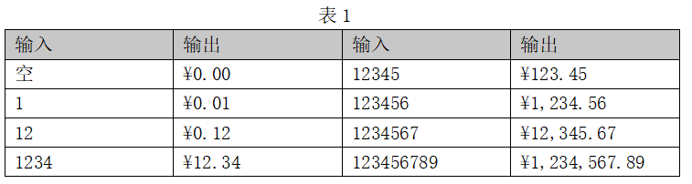

1. 以字符串的形式输入一个浮点数的字符串，通过程序转换成对应的浮点数，需要考虑输入数据的正负。(2014年高考)

```c
#include <stdio.h>
#define N 12
int main() 
{   char src[N],ch;
	int i, j, count=0; 	// count 用于记录某字符为小数点后第几位
	int isPositive=1, isBefore=1; // // isPositive用于标示正负，isBefore用于标记小数点前或小数点后
	double result=0;
    gets(src);
	for(i=0; i<N; i++)
    {    ch=src[i];
		if(ch!='\0')
         {   switch(ch)
             {  case '-': isPositive=0; break;
                case '.': isBefore=0;break;
			   default:if(ch>='0'&&ch<='9')
                      	{
						  if(isBefore)
                        	  ______________________;
						  else 
                            {
                        	      float temp=1;
                                  ______________________;
                                  for( j=0; j<count; j++){
                                       temp /= 10; 
							     }
                                  ______________________;
						  }//else
					  }//if
		     }//switch
        }// if
        else break;
    }//for    
	if(!isPositive)
		_____________________;
	printf("%lf",result);
}
```

2. 下面程序接收键盘输入，直到按回车键为止，然后将输入的字符串输出，输出时如果原输入字符是英文大写字母则转成小写字母输出，如果是小写字母则转成大写字母输出，如果有连续的一个以上的空格时只输出一个空格。（2012年高考）

```c
int main()
{   char cx, pre = '\0';
    while(______________ != '\n')
    {   if(cx != ' ')
            if(cx >= 'a' && cx <= 'z')  putchar(cx - 32);
            else if(cx <= 'Z' && cx >= 'A') _______________;
            else putchar(cx);
        else
            if(pre != ' ') putchar(cx);
        __________________;
    }
}
```

3. 函数`insert(char str1[], char str2[], int idx)` 实现在字符串`str1` 中的第`idx` 个字符后插入字符串`str2` ，如下程序的输出为：`abkkkcd` 。请填空。(2014年高考)

```c
void insert(char str1[], char str2[], int idx)
{   
    char *p = str1, *q; 
    int i = 0;
    for(i = 0; i < idx; i++)
        p++;
    while(*str2!='\0')
    {   
        q = p;
        while(*q != '\0')
            __________;
        while(q >= p){
            *(q+1) = *q;
            __________;
        }
        q++; *q = *str2; str2++;
        ______________;
    }
}
int main()
{   
    char a[10] = "abcd", b[5] = "zyx";
    insert(a,b,2);
    printf("%s", a);
}
```

5. 下列函数rtrin_str实现的是删除字符串str尾部的所有空格。(2010年高考)

```c
char* rtrim_str(char* str)
{	
    int n=______________;
	if(n<1)  return 0;
	while(n>0)
	{    if(*(str+n)!=' ')
		{
	    	_____________;      
			break;
		}
		else
	    	_____________;      
	}
	return str;
}
```

6. 会计记帐时通常要求大整数用逗号进行分隔，下列函数实现将以分为单位的数字字符串转变为以元为单位，具体输出格式如表1所示。请填空。（2011年高考）



```c
	char* dollars(char const* src)
	{   
         int len,lenl,i;
         char *dst,*resultp;
		if(NULL==src) 
            return NULL;
		len=strlen(src);
		lenl=len+len/3+2;
		dst=(char*)malloc(lenl);
		if(!dst)  return NULL;
		__________________________;
		*dst++='￥';  
		if(len>=3)
		{
			int i;
			for(i=len-2;i>0;)
			{
				*dst++=*src++;
				if( ___________________________ )  
					*dst++=',';
			}
		}
		else{	*dst++='0';	}
		*dst++='.';
		_______________________________________ ;
		*dst++=len<1?'0':*src;
		*dst=0;
		return resultp;
	}
```
