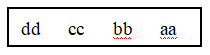

## 指针的地址运算

1. 若有定义`int n1 = 0, n2, *p = &n2, *q = &n1;` ，则赋值语句`n2=n1` 等价的是（                ）

```c
A. *p = *q;        B. p = q;        C. *p = &n1;        D. p = *q;
```

2. 以下程序运行结果是（        ）

```c
int x, y, z;
void p(int *x, int y)
{
    --*x; y++; z=*x+y;
}
int main()
{
    x = 5; y = 2; z = 0;
    p(&x,y); printf("%d,%d,%d#",x,y,z);
    p(&y,x); printf("%d,%d,%d" ,x,y,z);
}
```

3. 以下程序运行结果是（        ）

```c
int main()
{
    int a[10] = {1,2,3,4,5,6,7,8,9,10}, *p = &a[3], *q = p + 2;
    printf("%d %d", *p + *q, q - p);
}
```

4. 下面函数功能是返回字符串的长度，请填空。

```c
int mystrlen(char *s)
{    
    char *p = s;
    while(*p) p++;
    return _________;
}
```

5. 下面程序运行结果是（2011年高考）

```c
int main()
{   char a[] = {'a', 'b', 'c', 'd'};
    char *p = (char *)(&a+1);
    printf("%c,%c", *(a+1), *(p-1));
}
```

6. C语言中，一个2行3列的矩阵M如图所示，能得到M中数值为5的表达式是（                ）

```c
 M矩阵   3  8  9            A. *(M+1) + 1        B. *(*M+1) + 1
         2  5  6            C. *(*(M+1) +1)      D. **((*M+1) +1)
```

7. 若有定义语句`int a[3][5];` ，按内存中的数据存放顺序，第10个元素是（                ）

```c
A. a[1][4]        B. a[1][3]        C. a[2][3]        D. a[2][4]
```

8. 若`int a[2][3]={1,2,3,4,5,6};`，则不能访问`a[1][2]` 值的是（            ）

```c
A. *(a[1]+2)      B. *(*(a+1)+2)    C. *(a+2)         D. *(&a[1][0] + 2)
```

9. 若有定义语句`char *aa[2] = {"abcd", "ABCD"};` ，则以下说法正确的是（        ）

```c
A. aa数组的元素值分别是字符串"abcd"和"ABCD"的内容。
B. aa是指针变量，它指向含有两个数组元素的字符型一维数组。
C. aa数组的两个元素分别存放的是字符串的首地址
D. aa数组的两个元素中各自存放了字符"a"和"A"
```

10. 若有定义`int k[2][3], *pk[3];` ，则下列语句中正确的是（        ）

```c
A. pk = k;        B. pk[0] = &k[1][2];        C. pk = k[0];        D. pk[1] = k;
```

11. 若有下面的程序代码，则以下选项中对数组元素的错误引用是（        ）

```c
int a[12] = {1,2,3,4,5,6,7,8,9,10,11,12}, *p[3], **pp = p, i;
for(i = 0; i < 3; i++) p[i] = &a[i*4];
A. pp[0][1]        B. a[10]        C.p[3][1]        D. *(*(p+2) + 2)
```

12. 有以下定义语句，则`*(p[0] + 1)` 所代表的数组元素是（        ）

```c
int a[3][2] = {1,2,3,4,5,6}, *p[3];
p[0] = a[1];
A. a[0][1]        B. a[1][0]        C. a[1][1]        D. a[1][2]
```

13. 下面程序输出结果是（                ）

```c
void fun(char *s[], int n)
{   char *t; int i, j;
    for(i = 0; i < n-1; i++)
        for(j = i + 1; j < n; j++)
            if(strlen(s[i]) > strlen(s[j])){
                t = s[i]; s[i] = s[j]; s[j] = t;
            }
}
int main()
{    char *ss[] = {"bcc", "bbcc", "xy", "aaaacc", "aabcc"};
     fun(ss,5);
     printf("%s,%s\n",ss[0], ss[4]);
}
```

14. 下面程序输出结果是（            ）

```c
int main()
{   char *p[] = {"BOOL", "OPK", "H", "SP"}; int i;
    for(i = 3; i >= 0; i--,i--) printf("%c", *p[i]);
}
```

15. 下面程序输出结果是（                ）

```c
int main()
{    char *p[] = {"3679", "2584"}; int i, j, num = 0;
     for(i = 0; i < 2; i++)
     {   j = 0;
         while(p[i][j] != '\0'){
             if( (p[i][j] - '0')%2 ) num = 10*num + p[i][j] - '0';
             j += 2;
         }
     }
     printf("%d", num);
}
```

16. 下面程序输出结果是（                ）

```c
int main()
{
    int i; char a[10], b[10], *st[] = {"one", "two", "three", "fout"};
    printf("%s#", *st);
    for(i = 0; i < 4; i++)
        b[i] = *(st[i] +1);
    b[i] = '\0';
    puts(b);
}
```

17. 以下面程序运行后输入`3  5` ，则允许结果是（                    ）

```c
int main()
{
    int i, m, n; char *s[5] = {"Monday", "Tuesday", "Wednesday", "Thursday", "Friday"}, **p = s;
    scanf("%d%d", &m, &n);
    for(i = 0; i < m; i++) p++;
    printf("%s\n", *p);
    printf("%c", *(*p+n));
}
```

18. 下面程序输出结果是（            ）

```c
int main()
{   char ch[2][5] = {"1981", "0921"}, *p[2]; int i, j, s = 0;
    for(i = 0; i < 2; i++)
        p[i] = ch[i];
    for(i = 0; i < 2; i++)
        for(j = 1; j <= 3; j+=2)
            s = 10 * s + p[i][j] - '0';
    printf("%d", s);
}
```

19. 下面程序运行结果是（            ）

```c
int main()
{    char **p, *t[] = {"pingpong", "basketball", "field hockey", "softball"};
     for(p = t+3; p >= t; p--)
         printf("%c", *(*p+1));
}
```

20. 以下函数的功能是：在指针数组表示的字符串列表中查找特定的字符，指针数组以NULL指针结束，如果找到返回TRUE，否则返回FALSE。程序中有两处错误，将错误的行号及正确语句填入答题卡相应位置，不得增行或删行。(2011年高考)

```c
L1	#include<stdio.h>
L2	#include<string.h>
L3	#define TRUE 1
L4	#define FALSE 0
L5	int find_string(char** strings,char value)
L6	{
L7		char* cur_str;
L8		if(*strings==NULL)
L9			return FALSE;
L10		while((cur_str=*strings)!=NULL
L11		{
L12			while(cur_str!="\0")
L13				if(*cur_str++==value)
L14					return TRUE;
L15		}
L16		return FALSE;
L17	}
```

21. 下列函数fun()的功能是:从n个字符串中找出最长的那个串,并将其地址作为函数值返回｡（2008年高考）

```c
#include <string.h>
#include <stdio.h>
#define N 4
#define M 50
char *fun(char(*q)[M])
{   int i; char *p;
    _________________________________;
    for(i=0;i<N;i++)
    	if(_________________________)
    		________________________;
    return p;
}
int main()
{   char str[N][M]={"pingpong","basketball","field hockey","softball"}, *longest;
    longest=fun(str);
    printf("\nthe longest string:\n");
    puts(longest);
}
```

22. 以下程序将数组中元素逆序输出，运行结果如图8所示。程序中存在2处错误。



```c
  L1	#include<stdio.h>
  L2	main()
  L3	{
  L4		char  *array[]={"aa", "bb", "cc", "dd"};
  L5		char  (**pt)[];
  L6		int  j;
  L7		pt=array+3;
  L8		for(j=3; j>=0; j--)
  L9			printf("%s  ", *(pt)[j]);
  L10  	}
```

