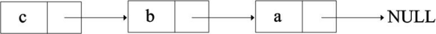
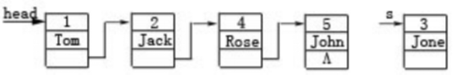
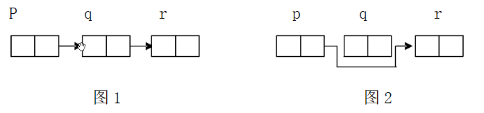

## 单链表历年高考题

###### 2020高考

1. 下面程序中定义了三个函数，其功能分别是添加链表结点、显示链表结点与删除来年表结点。如果添加的链表结点数据为“11，22，33，44，55”，则显示链表尾“11->22->33->44->55->End”。如果删除数据尾33的结点，则显示链表为“11->22->44->55->End”。请补充程序。

```c
#include<stdio.h>
#include<stdlib.h>
struct Node{
    int data;
    _____________________;
};
struct Node *AppNode(struct Node *head);  // 添加结点
void   DisNode(struct Node *head);		 // 显示结点
struct Node *DelNode(struct Node *head, int nodeData);// 删除结点

int main()
{
    int i = 0;
    struct Node *head = NULL;
    for(i = 0; i < 5; i++)
        head = AppNode(head);
    DisNode(head);
    head = DelNode(head, 33);
    DisNode(head);
    return 0;
}

struct Node *AppNode(struct Node *head)
{
    struct Node *p = NULL;
    _________________________;
    int data;
    p = _____________________;
    if(p == NULL){
        printf("No enough memory!");
        exit(0);
    }
    if(head == NULL)
        head = p;
    else{
        while(pr->next != NULL)
            pr = pr->next;
        pr->next = p;
    }
    pr = p;
    printf("input node data:");
    scanf("%d", &data);
    pr->data = data;
    pr->next = NULL;
    
    return head;
}

void DisNode(struct Node *head)
{
    struct Node *p = head;
    while(p != NULL){
        printf("%d->", p->data);
        p = p->next;
    }
    printf("End\n");
}

struct Node *DelNode(struct Node *head, int nodeData)
{
    struct Node *p = head, *pr = head;
    if(head == NULL){
        printf("No Linked Table!\n");
        return head;
    }
    while(nodeData != p->data && p->next != NULL){
        pr = p; 
        p = p->next;
    }
    if(________________)
    {
        if(p == head)
            head = p->next;
        else
            ______________________;
        free(p);
    }
    else
        printf("The Node has not found!");
    return head;
}

```

##### 2018年高考

3. 下列程序的主函数中，通过函数调用，把N 名学生的成绩放入一个带头结点的链表中，h指向链表的头结点。函数fun的功能是：找出N名学生中的最高分并返回，请补充程序。

```c
#include<stdio.h>
#define N 8
struct slist{
    int s;
    _____________;
};
tyedef struct slist STREC;

int fun(STREC *h)
{
	int max = h->s;
    while(____________)
    {
        if( max < h->s )
            max = h->s;
        _________________;
    }
    return max;
}

STREC *creat(int *s)
{
    STREC *h, *p, *q; // h 表示链表头
    int i = 0;
    h = p = (STREC *) malloc(sizeof(STREC));
    p->s = 0;
    while( i < N)
    {
        q = (STREC *)malloc(sizeof(STREC));
        q->s = s[i++];
        p->next = q;
        __________________________________;
    }
    p->next = NULL;
    return h;
}

int main()
{
    int s[N] = {85, 76, 69, 85, 91, 72, 64, 87}, max;
    STREC *head;
    ________________________________;
    max = fun(head);
    printf("max=%d\n", max);
}
```


###### 2017 年高考

4. 编写程序用于从键盘逐个读取整数，并将整数按照升序插入链表，每插入一个数后将链表中的数据都输出一次，当输入整数0时结束插入。

```c
#include<stdio.h>
#include<stdlib.h>
struct NumNode{
    int data;
    struct NumNode *next;
};
struct NumNode *insertToList(struct NumNode *head, int fdata)
{
    struct NumNode *p, *q;
    struct NumNode *newNode = (struct NumNode *)malloc(sizeof(struct NumNode));
    newNode->data = fdata;
    newNode->next = NULL;
    p = head;
    q = head;
    if(head == NULL)
    {
        _______________;
        return head;
    }
    while(p != NULL && fdata > p->data){
        q = p;
        p = p->next;
    }
    if(p != NULL)
    {
    	if(head == p){
            _____________________;
        }
        else{
            q->next = newNode;
        }
        _________________________;
    }
    else
    {
        _________________________;
    }
    return head;
}

void printList(struct NumNode *head)
{
    struct NumNode *p = head;
    while(p != NULL)
    {
        printf("%d ", p->data);
        p = p->next;
    }
    printf("\n");
}

int main()
{
    struct NumNode *head = NULL;
    int i;
    scanf("%d", &i);
    while( i != 0)
    {
        _________________;
        printList(head);
        scanf("%d", &i);
    }
    return 0;
}
```

###### 2015年高考

5. 编写程序用于从键盘读取一个字符串，将字符串中所有连续的数字转换为对应的整数并添加到链表中，整个字符串处理完毕后输出链表的内容。如输入为a25re776!jk321ss时，输出为25  776  321。请填空。

```c
#include <stdio.h>
#include <stdlib.h>
#define LEN sizeof(struct IntData)
struct IntData
{  
    long data;
   struct IntData *next;
};

/*将数据为data的新节点插入链表*/
struct IntData *addToList(long data,struct IntData * curTail)
{   
    struct IntData *p=(struct IntData *)malloc(LEN);
    p->data=data;
    p->next=NULL;
    if(curTail!=NULL)
        ___________________;
    return p;
}

struct IntData * picklntegersFromStr(char *str)
{
    char ch;
    long data=0;
    /*hasData用于标识当前是否正在处理数字字符*/
    /*isAdd标识处理的整数数据是否被添加到链表*/
	/*isFirst标识是否是添加到链表的第一个数据*/
    int hasData=0,isAdd=0,isFirst=1;
    /*tail指向链尾，head指向链头*/
    struct IntData *head=NULL,*tail=NULL,*p;
    while((ch=*str)!=’\0')
    {  
       if(ch>='0'&&ch<='9')
       {      
           _______________________________;
           hasData=1;
           isAdd=0;
       }
       else
       {  
           if(hasData&&!isAdd)
           {
               p=addToList(data,tail);
               ___________________________;         
              if(isFirst)
              {    
                  ________________________;
                  tail=p;
                  isFirst=0;
              }
              else 
                  tail=p;
              hasData=0;
              isAdd=1;
          }
       }
       str++;
    }
    if(hasData&&!isAdd)
    {    
        p=addToList(data,tail);
         if(isFirst)
             ___________________;
    }
    return head;
}
        
void printList(struct IntData *head)
{    
    struct IntData *p=head;
 	while(p!=NULL)
	{  
        printf("%d ",p->data);
    	p=p->next;
 	}
 	printf("\n");
}

int main()
{   
    char str[100];
	struct IntData *head=NULL;
	gets(str);
	head=picklntegersFromStr(str);
	printList(head);
    return 0;
}
```

###### 2014年高考

6. 函数creatList()用于从键盘读入整数，并根据输入的顺序建立链表，当输入-1时结束键盘读取，链表创建完成，其中-1不存入链表，头节点不存储数据，在main函数中调用0 creatList()函数创建链表，随后遍历链表输出链表所保存的数据。以下程序只允许修改三行。

```c
Ll    #incIude <stdio.h>
L2    struct Node {
L3       int data;
L4       struct Node *next;
L5     };
L6    struct Node *creatList(){
L7        struct Node p, q, head;
L8        int a;
L9        head=(struct Node *) malloc(sizeof(struct Node));
L10       p=q=head;
L11       printf("Input an integer number,enter-l to end:\n");
L12       scanf("%d",&a);
L13       while(a!=-l){
L14          p=(struct Node *)malloc(sizeof(struct Node));
L15          p->data=a;
L16          q->next=p;
L17          q=p;
L18          p->next=NULL;
L19          scanf("%d",&a);
L20    }
L21    return head;
L22  }
L23  main(){
L24     struct Node *head，*p;
L25     head=creatList();
L26     p=head->next;
L27     while(p){
L28         printf("%d\n",p->data);
L29         p->next = p
L30     }
L31   }
```

###### 2013年高考

7. 以下程序的功能是：读入一行字符，以回车结束，按输入时的逆序使用单向链表进行存储，先输入的位于链表尾，然后再遍历输出链表，如输入abc↙，链表结构如图所示，程序最后输出cba。



```c
#include<stdio.h>
struct node
{
	char value;
	struct node *link;
};
int main()
{
	struct node *top,*p;
	char c;
	top=NULL;
	while((c=getchar()) ____________ )
    {
    	p=(struct node *)malloc(sizeof(struct node));
    	p->value=c;
    	p->link=top;
     	__________________________________;
    }
    while(top)
    {
	    p=top;
    	top=top->link;
    	putchar(___________ );
    }
}
```

###### 2012年高考

8. Merge函数用于将两个升序的链表head1和head2合并成一个链表，并保持合并后链表依然升序。排序的依据为结构体类型Node中的data成员，合并中不得删除节点。下面给出Merge函数的主体框架,在空出的五个位置补充该主体框架缺失的代码段。注意：不能定义新的变量，可不用已定义的某些变量。

```c
typedef  struct  Node
{
    int   data；
    struct  Node  *next；
}Node;
Node  *Merge(Node  *head1，Node  *head2)
{
    if(head1==NULL)
    	return	head2;
    if(head2==NULL)
    	return headl;
    Node  *head=NULL;//head指针用于指向合并后链表的头结点
    Node  *pl=NULL;
    Node  *p2=NULL;
    if(headl->data<head2->data)
    {
    	head=headl;
    	_________________①______________
    	p2=head2;
    }
    else
    {
    	head=head2;
    	_______________②________________
    	pl=headl;
    }
    Node  *pcurrent=head;
    while(p1!=NULL&&p2!=NULL)
    {
    	if(pl->data<=p2->data)
        {
    		pcurrent->next=p1;
    		_________③___________________
    		p1=pl->next;
    	}
        else
        {
    		pcurrent->next=p2；
    		______④______________________
    		p2=p2->next;
    	}
    }
    if(pl!=NULL)
    	______________⑤_____________
    if(p2!=NULL)
    	pcurrent->next=p2;
    return head;
}
```

###### 2011年高考

9. 下列程序的功能是实现向head指向的链表中插入新结点s，如图所示，使该链表按结点的id值保持升序排列。



```c
#include<stdio.h>
#include<stdlib.h>
typedef struct Node{
	int id;
	char *name;
	struct Node *next;
}Node;
void Innode(Node *head,int id,char *str)
{
	int j=0;
	Node *p,*q,*s;
	p=head;
	while (_________________________)
	{
		q=p;
		p=p->next;
	}
	s=(Node*)malloc(sizeof(Node));
	s->id=id;
	s->name=str;
	___________________________
	___________________________
}
main()
{
	/*省略创建链表head的代码*/
	Innode(head,3,"Jone");		/*head指向如图17所示的链表*/
}
```

###### 2010年高考

10. 若有如图1所示存储结构，且变量定义为struct node{int data;struct node *next;}p,q,r;若要实现图2所示的存储结构，可选用的赋值语句是（       ）



```tex
A.p=r;		B.p=q->next;		C.p->next=q;	D.p->next=q->next;
```

