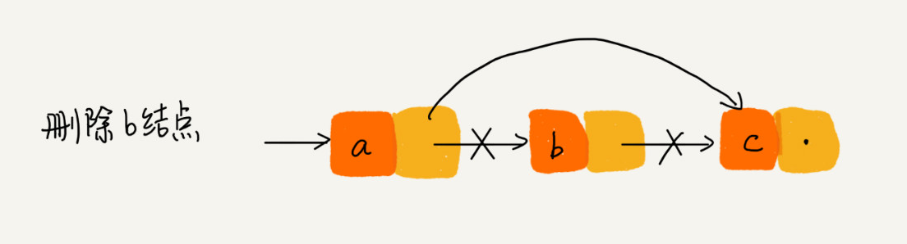
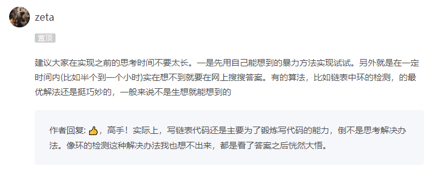

## 专题：单链表


- 链表结点

```c
struct node{
    int data;
    struct node *next;
};
```

- 结点的插入


​	错误写法，会发生指针丢失和内存泄露。

```c
p->next = x;  // 将p的next指针指向x结点；
x->next = p->next;  // 将x的结点的next指针指向b结点；
```

​	插入结点时，一定要注意操作的顺序。

```c
x->next = p->next;
p->next = x;
```

- 结点的删除



```c
a->next = a->next->next;
free(b);
```

- 不带头结点链表

  我们重新回顾链表的插入和删除。如果我们在p后面插入一个新的结点new_node，两行代码可以搞定。

```c
new_node->next = p->next;
p->next = new_node;
```

​	但是，如果链表是空，上面逻辑就不能用了。对于单链表的插入操作，第一个结点和其他结点的插入逻辑是不一样的。

```c
if (head == null) {
  head = new_node;
}
```

​	再看链表的删除，如果要删除p的后继结点，只需要一行代码搞定。

```c
p->next = p->next->next;
```

​	但是，如果删除的是第一个结点时（或者链表只有一个结点时），上面代码就不起作用了，需要特殊处理。

```c
if(head->next == NULL){  // 链表只有一个结点时
    head = head->next;
}
```

​	上述链表插入、删除操作，我们发现对处理第一个结点时，要做特殊判断处理，这样写出的代码会很繁琐，也容易因为考	虑不够全面而出错。如何更好的解决这个问题呢？带头结点的链表。

- 带头结点的链表


​	最前面一个结点，是哨兵结点（链表头结点），是不存储数据的。哨兵结点一直存在。所以，插入第一个结点和插入其他	结点一样，删除第一个结点和删除其他结点一样。

- 检测链表代码是否正确的方法

```tex
画图，考虑边界条件：
1）如果链表为空时，代码是否能正常工作？
2）如果链表只包含一个结点时，代码是否能正常工作？
3）如果链表只包含两个结点时，代码是否能正常工作？
4）代码逻辑在处理头结点和尾结点的时候，是否能正常工作？
```


###### 练习题

创建链表（头插法、尾插法）

链表插入节点保持升序（降序）

链表结点的删除

单链表反转

链表中环的检测

两个有序的链表合并

删除链表倒数第 n 个结点

求链表的中间结点

单链表回文判断

约瑟夫环问题

