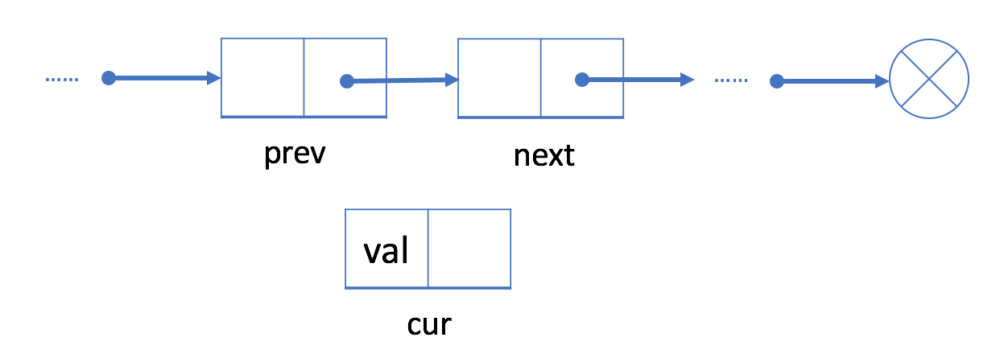
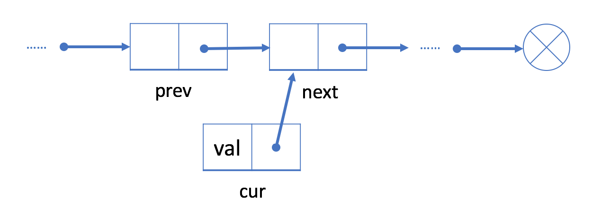
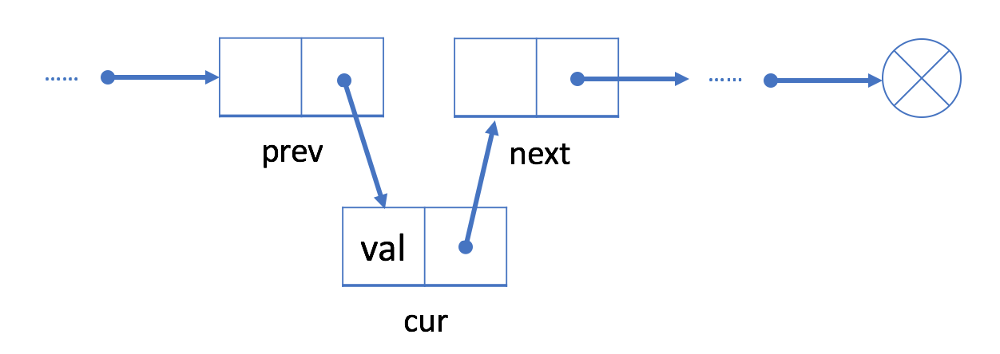
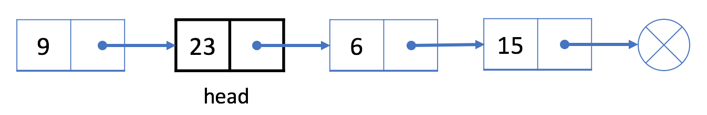
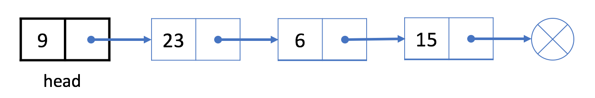
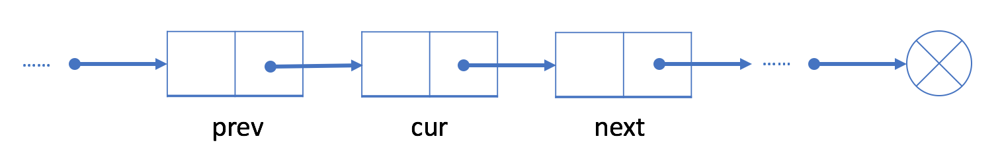
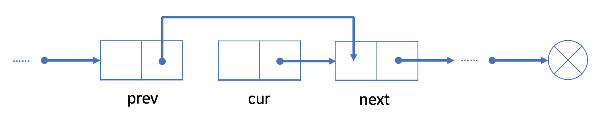
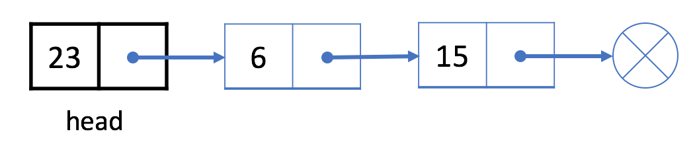
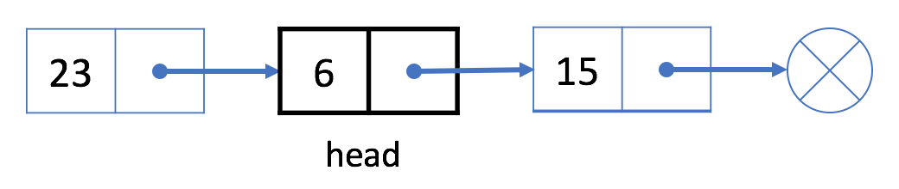

## 单链表


##### 〇 、结点定义

```c
struct ListNode {
     int val;
     struct ListNode *next;
 };
```

##### 一、链表的插入

如图所示，在给定的结点`prev` 之后添加新结点，我们分三步走，链表头更新的情况另外考虑。请填空：

1. 创建新的结点：`cur = _____________________________________`



2. 将`cur` 的`next` 字段链接到`prev`的下一个结点：`cur->next=_______________________`



3. 将`prev`的`next` 链接到`prev`：`prev->next = _______________________________`



4. 在链表头添加结点。





```c
cur = (ListNode*) malloc(sizeof(struct ListNode));
cur->val = 9;
_______________________ = head;
head = cur;
```

##### 二、链表的删除

如果我们从单链表中删除现有的结点`cur`，可以分三步走。链表头更新的情况，同样需要另外考虑。请填空：



1. 找到`cur`的前驱`prev`



2. 接下来让`prev`链接到`cur`的下一个结点： `prev->next = ______________________`

3. 释放`cur`结点的内存：`_____________________`

4. 如果删除的是链表第一个结点，我们需要特殊处理。





```c
if(cur == head){
    head = _________________;
    free(cur);
}
// 还有其它删除cur结点的方法吗？ p = cur->next;cur->val = p->val;cur->next = p->next;free(p)
```

##### 三、不带头的链表设计

下面具体探讨链表的插入、删除的代码实现：

```c
struct ListNode *AddAtEnd( struct ListNode *head, int val); // 尾插入
struct ListNode *AddAtHead( struct ListNode *head, int val);// 头插入
struct ListNode *insert(struct ListNode *head, int val);    // 排序插入（保持升序/降序）
struct ListNode *delet(struct ListNode *head, int val);     // 删除结点
void printLink(struct ListNode *head);					  // 删除链表

struct ListNode *find(struct ListNode *head, int val);      //查找值为val的结点
struct ListNode *findPrev(struct ListNode *head, int val);  //查找值为val的结点,返回它的前驱
struct ListNode *findPro(struct ListNode *head, int val);   //查找第一个大于val的结点
struct ListNode *findProPrev(struct ListNode *head, int val);//查找第一个大于val的结点，返回它的前驱

int getAtIndex(struct ListNode *head, int index);	            // 获得第index结点的val值
struct ListNode *AddAtIndex(struct ListNode *head,int index);   // 在第index结点前，插入一个结点
struct ListNode *DeletAtIndex(struct ListNode *head,int index); // 删除第index个结点
void ListFree(struct ListNode *head) ;		                   // 释放所有结点内存

解链表题方法：
1. 画图
2. 检查链表为NULL的情况
3. 检查处理头结点、尾结点的情况
4. 检查链表只有一个结点的情况
 
```

1. 在链表尾插入数据

```c
struct ListNode *GetEnd(struct ListNode *head)
{
    struct ListNode *q = head;
    while(q->next)
        q = q->next;
    return q;
}
struct ListNode * AddAtEnd( struct ListNode *head, int val)
{
    struct ListNode *p, *q;
    p = (struct ListNode *)malloc(sizeof(struct ListNode));
    p->val = val;
    p->next = NULL;
 
    if(head == NULL)  
        head = p;
    else{
        q = GetEnd(head);
        q->next = p;
    }
    return head;
}
```

2. 在链表头插入数据

```c
struct ListNode * AddAtHead( struct ListNode *head, int val)
{
    struct ListNode *p;
    p = (struct ListNode *)malloc(sizeof(struct ListNode));
    p->val = val;
    
    p->next = head;
    head = p;
    return head;
}
```

3. 创建含有n个结点的链表

```c
struct ListNode* create(int n)
{
    struct ListNode *head = NULL;// 一定要赋初始值为NULL
    int i, val;
    for(i = 1; i <= n; i++){
        scanf("%d", &val);
        head = AddAtEnd(head, val); // 尾插法
        //head = AddAtHead(head, val); // 头插法
        //head = insert(head, val);  // 排序插入
    }
    return head;
}

// 方法二：尾插法
struct ListNode* create2(int n)
{
    struct ListNode *head;// 链表头
    struct ListNode *p;   // 链表尾
    struct ListNode *q;   // 链表新结点
    head = p = q = (struct ListNode *)malloc(sizeof(struct ListNode));
    scanf("%d", &q->val);
    while(--n)
    {
        q = (struct ListNode *)malloc(sizeof(struct ListNode));
    	scanf("%d", &q->val);
        p->next = q;
        p = q;
    }
    p->next = NULL;
    return head;
}
```

4. 查找值等于val的结点。

```c
//方法一
struct ListNode *find(struct ListNode *head, int val)
{
    struct ListNode *p = head;
    while(p && p->val != val)
        p = p->next;
    // 循环结束时：p == NULL ||    p->val == val
    // 1）p == NULL 表示所有结点值都不等于val ， 即没有找到val，返回NULL。
    // 2）p->val == val，注意：要检测p是否为NULL, p不为NULL，表示找到了值为val的结点p，即返回p。
    if(p) return p;
    else return NULL;
}

//方法二
struct ListNode *find2(struct ListNode *head, int val)
{
    struct ListNode *p = head;
    if(head == NULL) return NULL;
    while(p->next && p->val != val)
        p = p->next;
    // 循环结束时： p->next == NULL ||   p->val == val 
    // 1）p->next == NULL，表示p前面所有结点都不是val,但最后一个结点还需要一次p->val == val的比较
    // 2) p->val == val，表示找到了值为val的结点p 
    
    if(p->val == val)  return p;
    else  return NULL;
}
```

5. 查找值等于val的结点，返回它的前驱。

```c
//方法一
struct ListNode *findPrev(struct ListNode *head, int val)
{
    struct ListNode *p = head, *pr = NULL;
    while(p && p->val != val){
        prev = p;
        p = p->next;
    }
    // 循环结束时：p == NULL || p->val == val
    // 1）p == NULL，表示所有结点值都不等于val,没找到结点，返回链表最后一个结点，pr
    // 2）p->val == val，表示找到了值为val的结点p，如果p==head前驱是NULL，否则，前驱是结点pr
    if(p) return pr;
    else return pr;
}

//方法二
struct ListNode *findPrev2(struct ListNode *head, int val)
{
    struct ListNode *p = head, *pr = NULL;
    while(p->next && p->val != val){
        pr = p;
        p = p->next;
    }
    // 循环结束时： p->next == NULL  ||   p->val == val 
    // 1）p->next == NULL，表示p前面所有结点都不是val,但最后一个结点还需要一次p->val == val的比较
    // 2) p->val == val,找到了值为val的结点p,如果p==head前驱是NULL，否则，前驱是有效结点pr
    
    if(p->val == val)  return pr;
    else  return NULL;
}

//方法三
struct ListNode *findPrev3(struct ListNode *head, int val)
{
    struct ListNode *p = head;
    if(head == NULL) return NULL;
    if(head->val == val)return NULL;
    
    while(p->next && p->next->val != val){
        p = p->next;
    }
    // 循环结束时： p->next == NULL  ||   p->next->val == val 
    // 1）p->next == NULL，表示所有结点都不等于val(包括最后一个结点)，返回链表最后一个结点p
    // 2) p->next->val == val,找到了值为val的结点p->next,返回前驱p
    
    return p;
}
```

6. 假设链表数据是升序，查找第一个大于val结点。

```c
struct ListNode *findPro(struct ListNode *head, int val)
{
    struct ListNode *p = head;
    while(p && p->val <= val)
        p = p->next;
    // 循环结束时：p==NULL       ||   p->val > val
    // 所有结点值都小于等于val    或   找到了第一个大于val的结点p
    // 应该返回NULL                  应该返回  p 
    if(p) return p;
    else return NULL;
}

struct ListNode *findPro2(struct ListNode *head, int val)
{
    struct ListNode *p = head;
    while(p->next && p->val <= val)
        p = p->next;
    // 循环结束时：p->nex==NULL                     ||    p->val > val
    // p前面所有结点都小于等于val,最后一个结点没有比较  或者 找到了第一个大于val的结点p
    
    if(p->val > val) return p;
    else return NULL;
}
```

7. 假设链表数据是升序，查找第一个大于val结点，返回该结点的前驱。

```c
struct ListNode *findProPrev(struct ListNode *head)
{
    struct ListNode *p = head, *pr = NULL;
    while(p && p->val <= val){
        pr = p;
        p = p->next;
    }
        
    // 循环结束时：p==NULL       ||   p->val > val
    // 所有结点值都小于等于val    或   找到了第一个大于val的结点p
    // 返回最后一个结点:pro            返回p的前驱结点：pr   当p==head时，返回的pr为NULL
    return pr;
}

struct ListNode *findProPrev(struct ListNode *head)
{
    struct ListNode *p = head, *pr = NULL;
    while(p->next && p->val <= val){
        pr = p;
        p = p->next;
    }
        
    // 循环结束时：p->next==NULL                    ||   p->val > val
    // p前面所有结点都小于等于val,最后一个结点没有比较  或者 找到了第一个大于val的结点p
    
    if(p->val > val)
        return pr;
    else
        return p;
}

//方法三
struct ListNode *findProPrev(struct ListNode *head, int val)
{
    struct ListNode *p = head;
    if(head == NULL) return NULL;
    if(head->val > val)return NULL;
    
    while(p->next && p->next->val <= val){
        p = p->next;
    }
    // 循环结束时： p->next == NULL  ||   p->next->val > val 
    // 1）p->next == NULL，表示所有结点都不等于val(包括最后一个结点)，返回链表最后一个结点p
    // 2) p->next->val > val,找到了值为val的结点p->next,返回前驱p
    
    return p;
}
```

8. 插入一个结点保持升序

```c
struct ListNode *insert(struct ListNode *head, int val)
{
    struct ListNode *p = head, *pro = NULL, *newnode;
    
    newnode = (struct ListNode*)malloc(sizeof(struct ListNode));
    newnode->val = val;
    
    while(p && p->val <= val){
        pro = p;
        p = p->next;
    }
    // 循环结束时：p==NULL       ||   p->val > val
    // 所有结点值都小于等于val    或   找到了第一个大于val的结点p
    // 最后一个结点:pro              返回p的前驱结点：pro 当p==head时，pro为NULL 新结点插入在head前
    // 数据val插入在pro之后                             否则 插入在pro之后
    
    // 形式一：2017年高考
    if(p){
        if(p == head){
            newnode->next = head;
        	head = newnode;
        }
        else{
            pro->next = newnode;
            newnode->next = p;
        }
    }
    else
        pro->next = newnode;
    
    /* 形式二：
    if(p == head){				// 形式三：也可以改为  if(!pro)
        newnode->next = head;   //新结点插入在head之前
        head = newnode;
    }
    else{
        pro->next = newnode;    //新结点插入在pro之后
        newnode->next = p;
    }
    */
}
```

9. 插入一个结点保持降序

```c
struct ListNode *insert(struct ListNode *head, int val)
{
  
}
```

10. 删除值为`val`的结点

```c
struct ListNode *delet(struct ListNode *head, int val)
{
    
}
```


上机作业：

1） https://www.dotcpp.com/oj/problem2024.html

2） https://www.dotcpp.com/oj/problem1771.html

##### 四、带头结点的链表设计

```c

int myLinkedListGet(MyLinkedList* obj, int index) ; // 获得第index结点的val值
MyLinkedList* myLinkedListAddAtIndex(MyLinkedList* obj, int index, int val);
MyLinkedList* myLinkedListDeleteAtIndex(MyLinkedList* obj, int index);
MyLinkedList *myLinkedListAddKeepSort(MyLinkedList* obj, int val);
void myLinkedListFree(MyLinkedList* obj) ;
void myLinkedListPrint(MyLinkedList* obj) ;
```

上机作业

https://www.dotcpp.com/oj/problem1676.html

参考代码

```c

```


