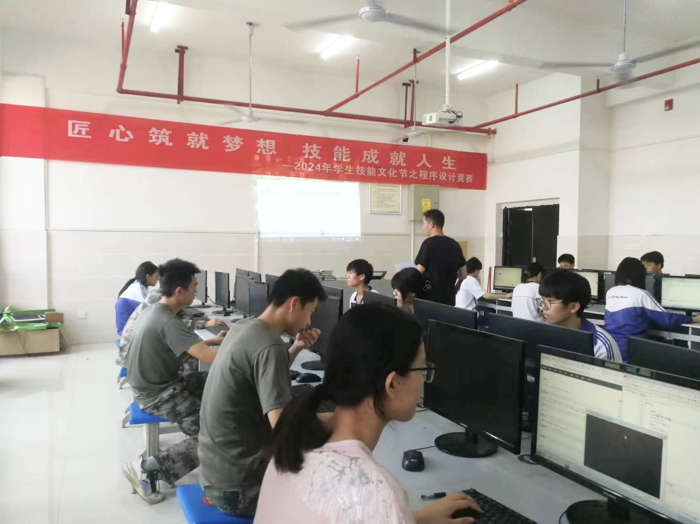
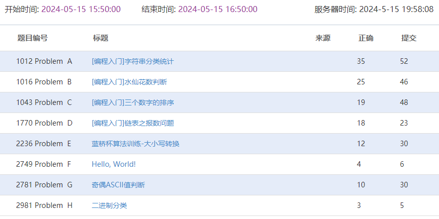
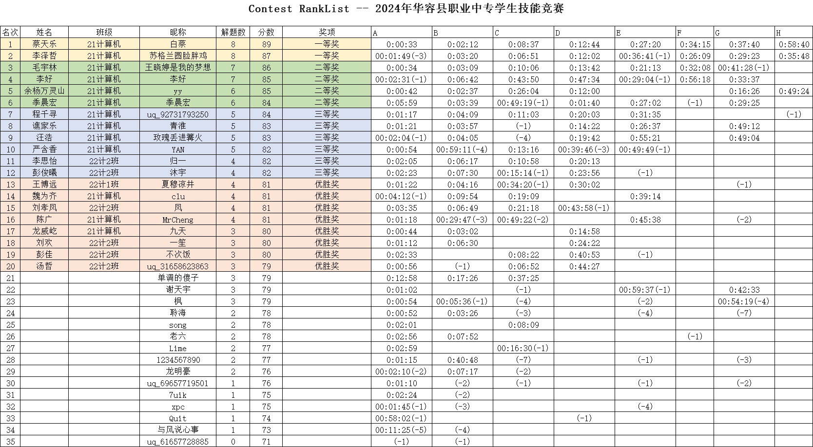
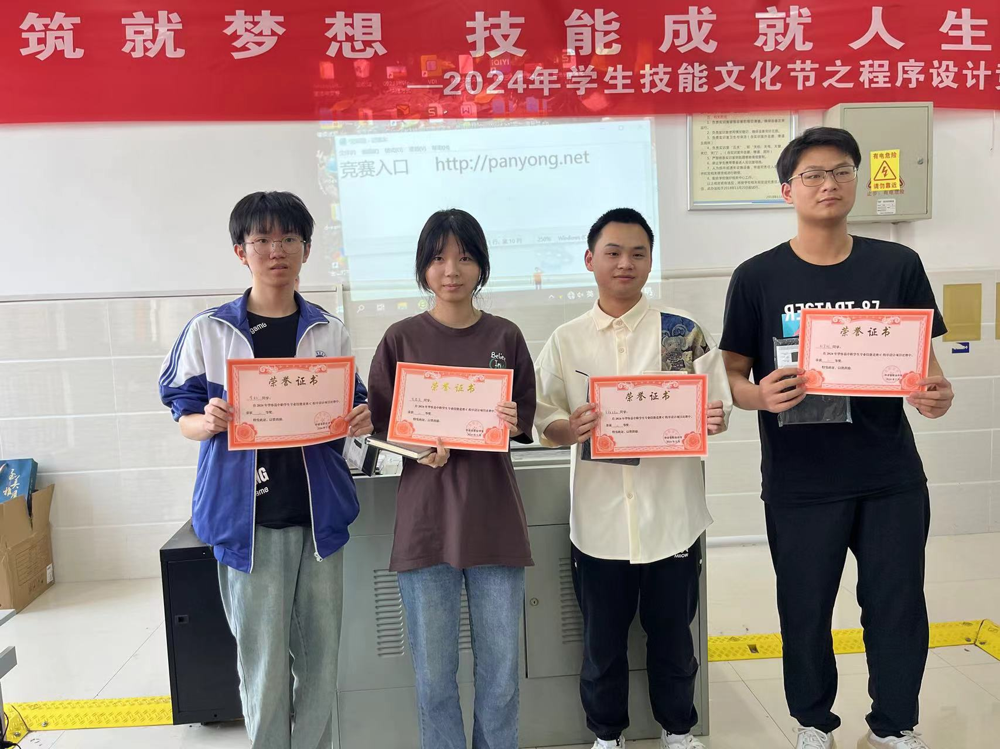
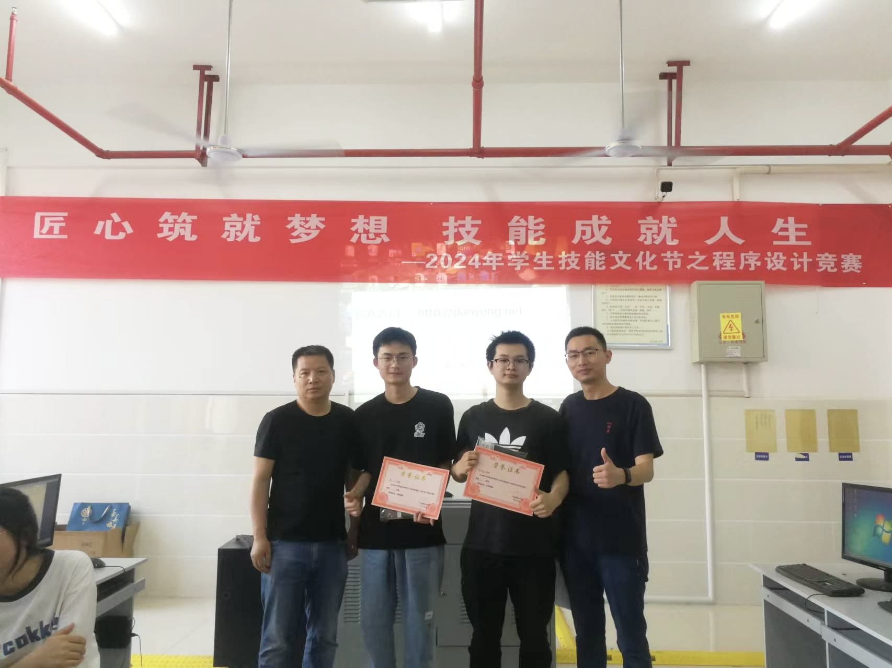
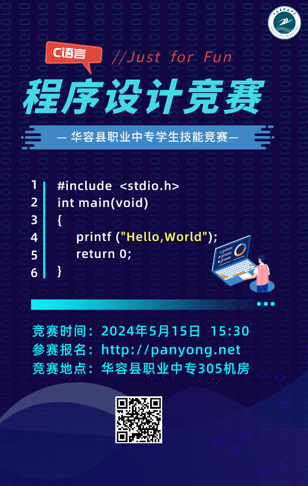

#### 2024年5月15日C语言程序设计竞赛小结

2024年5月15日下午3点半，华容县职业中专计算机专业C语言程序设计竞赛，在305机房如期举行。参赛选手共35人，21计1班18人，22计1班4人，22计2班10人，22国防班3人。

本次竞赛评委有何朝辉、胡承发、喻杰、潘勇等老师。

下午 `16:50` 竞赛结束，学生们认真参赛，每个班都涌现出了优秀选手，成绩排名如下：

优胜奖（8名）：王博远、魏为齐、刘孝凤、陈广、龙威屹、刘欢、彭佳、汤哲

三等奖（6名）：程千寻、谯家乐、汪浩、严含香、李思怡、彭俊曦

二等奖（4名）：毛宇林、李好、余杨万灵山、季晨宏

一等奖（2名）：蔡天乐、李泽哲

本次竞赛，为学校技能文化节系列活动之一，是为了更好的激发学生学习兴趣，锻炼学生实践能力。在各班老师的反复多次的鼓励下，学生参与积极踊跃。同时，竞赛精心命题，紧扣对口高考大纲。竞赛形式，类似大学生ACM竞赛，编写代码解题，平台自动判题打分，重点考查动手实践，很好的融合了考试与实践。

在计算机组师生共同努力下，本次竞赛圆满结束。祝同学们学习进步，前程似锦！

2023年5月15日

###### 附录

- 竞赛赛题：https://www.dotcpp.com/oj/contest.php?cid=6414
- 成绩排名：https://www.dotcpp.com/oj/contestrank.php?cid=6414
- 参考代码：https://lightly.teamcode.com/46720250/202405JingSai
- 活动海报：

