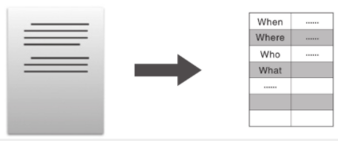

## 阅读理解

###### 什么是合格的阅读理解

阅读理解其实是一种信息的转换。

###### 深层：理解作品和文章深意的五个要素

不仅阅读时要把握文章的结构，在写作时，也应该先考虑结构，再写细节内容，而不是想到哪里就写到哪里。很多人在写作时经常会卡壳，半天憋不出几段文字。其实我自己以及我的孩子在中学时都遇到过这种问题。我最终的解决办法就是先搭好文章的架子，也就是先确定结构，再填入内容。中间难免会遇到卡壳的地方，但是有了架子，就能先把这里跳过去，把该写的写好，暂时不会写的最后再补。我的孩子也是采用这个方法，逐渐度过了“写不出来”的阶段。