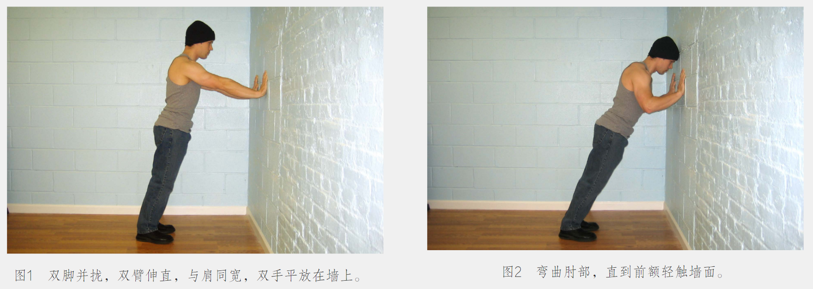

[TOC]


## 增肌


### 《囚徒健身》

#### 第一部分：预备

- 他的自由被剥夺——关押在美国最严酷的几所监狱中。为了简单而残酷的生存需要，他不得不求助于力量。他一无所有，除了自己的身体与心灵。困难重重之下，他选择自我培养，创造了无人能夺的自由——让身心强大的自由。


- 有多少人真正强大有力？

```tex
多少人具有真正的能派上用场的运动能力呢？
多少人能俯身来20个完美的单臂俯卧撑呢？
多少人的脊椎足够强健、灵活、健康，能够后弯腰摸到地板呢？
多少人能单靠膝盖和臀部的力量单腿径直下蹲至地面再站起来呢？
多少人能抓住高过头顶的横杆来一个毫无瑕疵的单臂引体向上呢？

几乎没有。
```


- 健身房锻炼存在的问题？

```tex
1. 塑形？
用低次数锻炼或拿起最小巧的哑铃，然后开始一遍遍地举起放下，边做边数数，其实对健康毫无帮助。

2. 重量训练？
会毁坏关节，练忽略或者破坏竖脊肌、腰部、手脚、颈部以及人体的深层组织（如腹横肌或肩袖），而这些部位对真正有用的力量和运动能力是至关重要的。
```

​	*虽然作者反对到健身房锻炼，但是相比锻炼方法，对普通人而言，开始锻炼起来更重要。*


- 如何用自身体重锻炼？

```tex
括俯卧撑、引体向上、深蹲等，这些都是很好的练习动作。但是在做这些动作的过程中你没有负重，所以反复做虽然可以提高你的耐力，但不会使你的力量大大增强。

核心内容：“六艺”与“十式”

俯卧撑：手臂和胸肌     				-->  单手俯卧撑
深蹲：腿       				 -->  单腿深蹲
引体向上：背部和肱二头肌
举腿：腰腹
桥：脊柱。人体最重要的器官是大脑，控制身体每个部位。其次，就是脊柱。
倒立撑：肩膀。

终极目标必须是完美地做到六个最终。
```

#### 第二部分：六艺

##### 俯卧撑：胸肌与肱三头肌

*俯卧撑好于卧推*

- 找到适合自己的姿势
- 躯干、髋部、双腿始终要成一条直线。
- 双腿始终要并拢。如果双腿分开，做动作时就无需保持躯干稳定，练习就变容易了。
- 在动作最高点时，双臂要伸直，但不要让肘部完全锁定，而要使其微弯，以免关节不舒服。
- 平缓地呼吸，上推时应呼气，下降时应吸气。
- 做得慢一些，用2秒降到最低点，坚持1秒，再用2秒回到最高。

###### 俯卧撑：第一式



```tex
训练目标
初级标准：1组，10次
中级标准：2组，各25次
升级标准：3组，各50
```


#### 第三部分：做自己的教练

- 热身
- 一定要从最简单的动作开始，然后逐渐增加强度。

- 训练势头：简单地说，这意味着如果你在训练中更慢地向前推进，你实际上会比急于求成者更快达到目标。听着像悖论，但这就是事实。聪明的举重教练会对毛躁的年轻选手说这样一句老话：“杠铃又不会跑掉。”不要执著于数字，你的身体并不理解数字，也不在乎你做的动作是不是更高级、更酷，你的身体只理解你的努力。
- 持续训练一年以上。
- 将注意力集中到你所能做的难度最高的动作上，但是如果你的动作开始走形，就应该立即结束该组练习。

