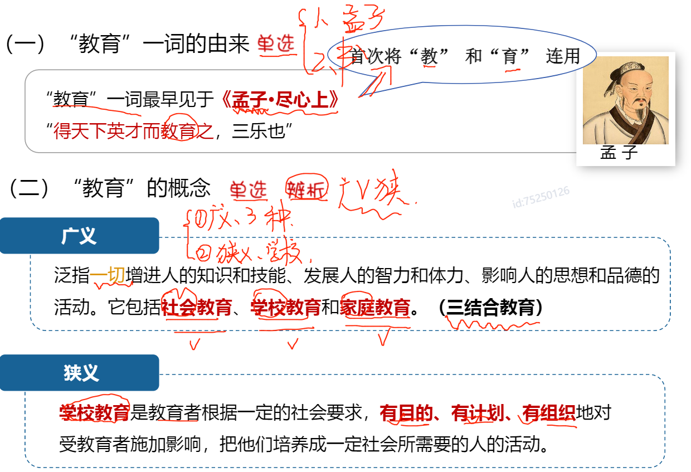
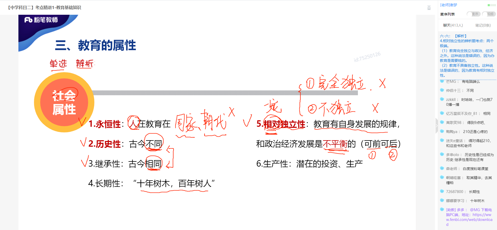
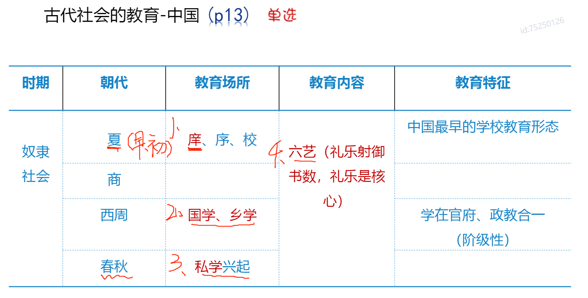
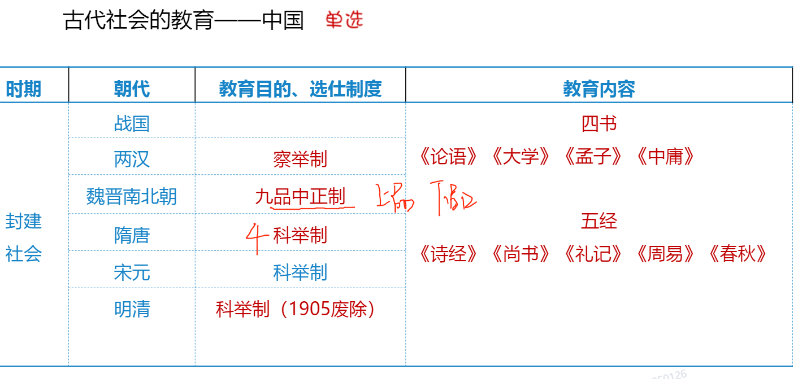
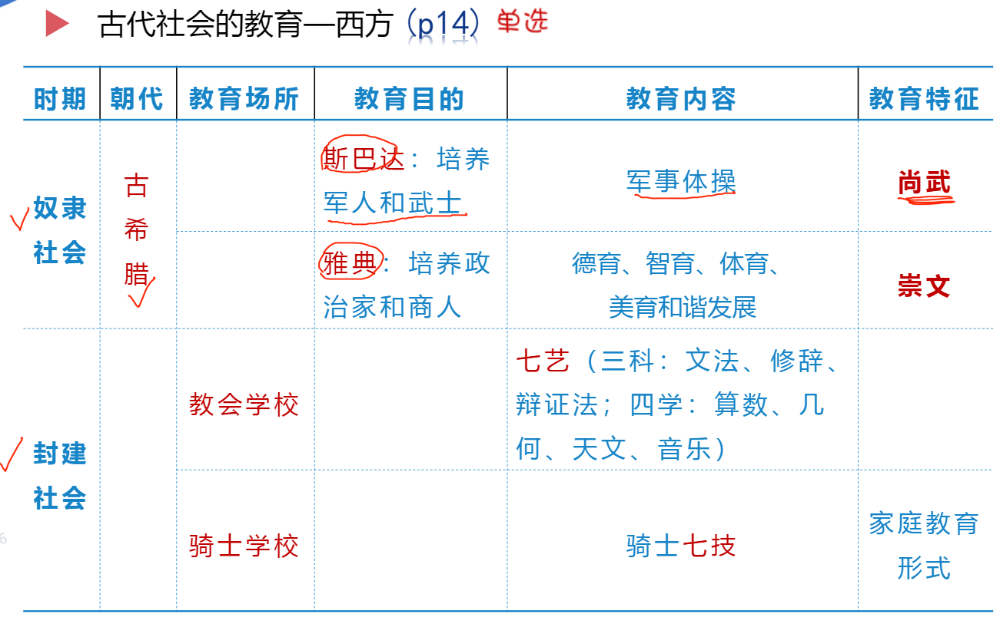
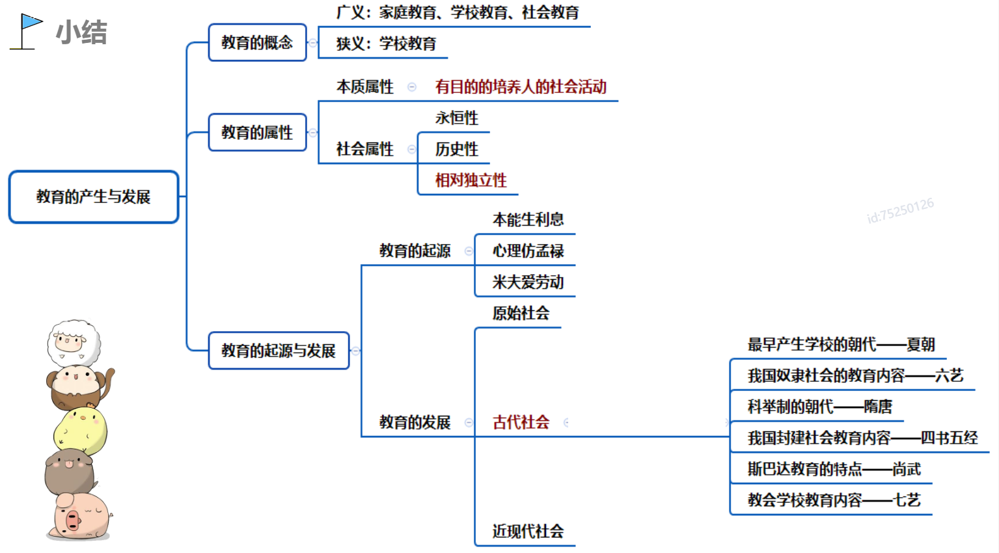
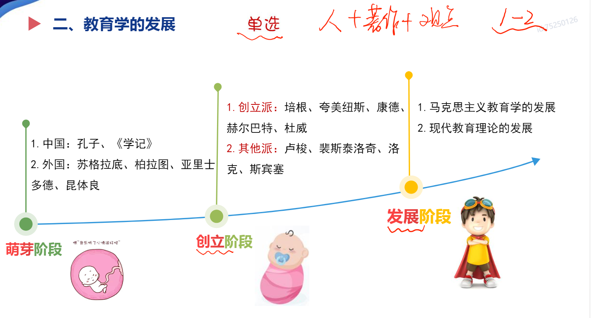

## 第一章：教育基础知识

[TOC]

*2021.8.27 谢梦*

#### 第一节：教育的产生与发展

###### 1. 教育的概念



###### 2. 教育的属性（特点）

- 本质属性：教育是**有目的**的培养**人**的**社会活动**。

```tex
谢梦老师，这段讲解，引用母猪上树的例子，很有趣。
```

- 社会属性：




###### 3. 教育的起源与发展







###### 4. 小结




#### 第二节：教育学的发展



1. 萌芽阶段（教育学还没有形成独立学科）
   - 东方
     - 《学记》：战国末期成书，最早论述教育问题的著作
       - 建国君民，教学为先。
       - 道而弗牵，强而弗抑，
     - 孔子《论语》
       - 有教无类（有肉干就教，教育平等）
       - 六经：诗、书、礼、易、春秋、乐
       - 
   - 苏格拉底、柏拉图、亚里斯多德、

